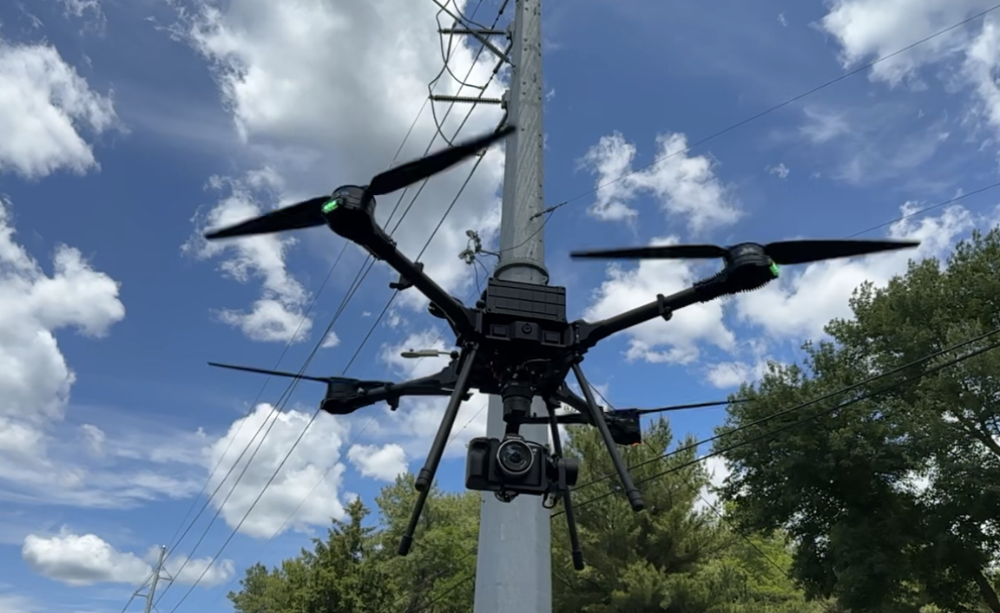

# Aurora (CRD1)

<figure><figcaption></figcaption></figure>

Introducing Aurora, the newest addition to Camflite's aircraft lineup with remarkable expandability and customization features. It is designed to withstand any challenge, making it the reliable workhorse drone that Camflite pilots have always trusted.


[getting-started.md](camflite-aurora-intro/getting-started.md)


Here's a quick start to help you get started.


[camflite-aurora-intro](camflite-aurora-intro/)



Please note that this manual is not meant to replace proper flight training. Different countries and flight conditions may have varying training requirements, so it's important to check local regulations before operating the Aurora. In regions without established training requirements, the pilot-in-command must determine if they possess sufficient training and experience for a particular flight. It's important to set personal minimums and only fly within your capabilities.



[maintenace-manual](maintenace-manual/)


This document outlines the maintenance schedule and details different maintenance procedures.


[payload](payload/)


This resource provides a comprehensive guide to all payloads, both official and unofficial, that are compatible with Aurora. It also offers operational and maintenance instructions for each payload.

## Formatting


‌Warnings are used to highlight procedures that, if not strictly observed, may result in personal injury.



Cautions are essential to emphasize procedures that must be strictly followed to prevent damage to equipment.



One can use notes to emphasize certain operating conditions, provide helpful usability tips, or outline the steps of a procedure.


## Support

If you need any help or have questions, [Contact Camflite.](https://camflite.com/pages/contact-us)
