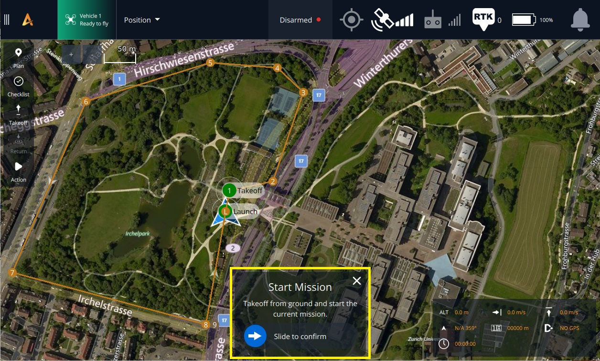

# Flight Modes

Aurora provides the pilot with different levels of assistance through its multiple flight modes. You can switch between these modes using the pilot's handset or the AMC app on Herelink or PC. It's recommended to refer to the documentation for the equipment you use to familiarize yourself with the buttons or switches involved in the process.

Aurora offers several flight modes with varying levels of assistance to the pilot. Flight mode can be changed via the pilot's handset and the AMC app on Herelink or PC. See the documentation for the equipment you use to familiarize yourself with the buttons/switches involved.


Manual Mode may be necessary to react to emergencies. Pilots should be proficient in Manual Mode. Position, Altitude, and Return Mode are assistive only and are not a replacement for pilot skill and preparedness.&#x20;



Always neutralize the control input sticks on the pilot handset when switching between control modes to prevent unexpected aircraft movement.



The Aurora does not ship with Manual Mode enabled; if you require that, contact us for how to add that option.


### Pilot-controlled Modes



When the sticks are in the middle, the aircraft will hold position over a spot on the ground while maintaining altitude and compensating for disturbances in Position Mode. With Position Mode, the drone's speed in relation to the ground is controlled via the pitch/roll stick. The pitch/roll stick's height will determine how quickly.&#x20;

Aurora moves forward. Aurora will fly backward if the pitch/roll stick is dragged downward. Similarly, moving the pitch/roll stick to the left or right will cause the drone to go in a left or right direction. The throttle stick controls vertical speed. The quicker Aurora climbs, the higher the throttle stick is moved. On the other hand, Aurora will fall more quickly the lower the throttle stick position is set. The yaw is managed by moving the throttle stick in opposite directions.



The pitch/roll stick is used for lateral movement to control the Aurora drone, while the throttle stick controls the vertical speed and yaw. The drone relies on the barometer and GPS to maintain its vertical position in Altitude mode. However, the autopilot does not control the lateral speed, meaning the drone may drift with the wind without pilot input and will not immediately stop after lateral movement. Therefore, the pilot should always be attentive and adjust to keep the drone in a single position above the ground.



**Manual mode is not set up by default but can be configured by the user.**

When operating in manual mode, the aircraft will maintain level flight and drift with the wind if the pitch and roll sticks are in the middle position. To maintain altitude, the throttle will require constant adjustments. The pitch and roll sticks determine the aircraft's angle. By raising the pitch stick, the aircraft will lean forward, and by lowering it, the aircraft will tilt rearward. The same applies to rolling left and right. The autopilot does not control lateral speed; direct motor speed control is used through the throttle stick. The Yaw rate is adjusted by moving the throttle stick left or right, with stick deflection affecting yaw rotation speed proportionally. By default, the thrust created by Aurora when the throttle stick is in the middle is set to 34%. This setting allows Aurora to hover, and a payload of up to 1500 grams can hover at around 40%. These are the settings for Manual Mode.




To activate Position Mode, a robust GPS signal is required. Aurora cannot enter this mode if a weak signal is detected. If the signal weakens, for instance, when close to buildings or under thick tree coverage, the aircraft will automatically transition to Altitude mode.



When flying in areas with weak or disrupted GPS signals, like near buildings or under dense tree cover, it's best to avoid using Position Mode. This is because the automatic transition to Altitude Mode may cause unexpected changes in flight behavior, which could be dangerous.


### Autonomous Modes



To activate Return Mode, the pilot can direct Aurora to ascend to a specific Return Altitude, fly straight back to the Home Point, and land safely. It's important to note that GPS capability is necessary for Return Mode to function correctly. The pilot can set the Return Altitude in AMC > Vehicle Setup > Safety. However, if Aurora is already at or above the Return Altitude when Return Mode is activated, it will remain at its current altitude rather than descending. The GPS coordinates at which Aurora is armed determine the Home Point, which is reset every time Aurora is armed. Additionally, certain Failsafes may trigger Return Mode automatically. For further information on Failsafes, kindly refer to the manual.


A helpful tip to ensure safe flying is to consider the aircraft's path in case Return Mode is triggered. It's important to adjust settings accordingly to prevent any mishaps. For instance, turning on Return Mode while flying under an obstacle lower than the Return Altitude could result in a collision when the aircraft tries to ascend to that altitude. Depending on the situation, it may not be feasible to set a lower Return Altitude or use Return Mode at all.



If you want to switch from Return to Position Mode, you can do so by moving the sticks. However, if the low battery failsafe has activated Return Mode, you must press a different flight mode button to exit Return Mode.




To initiate Takeoff Mode, simply use the button located in the Fly view section of the AMC (Aurora Mission Control) app. Once activated, the aircraft will ascend to the designated Takeoff Altitude before entering Hold Mode (also referred to as loiter or hover). You can adjust the Takeoff Altitude using the provided slider and confirm your selection by holding or sliding the button. It's important to note that Takeoff Mode can also be initiated during a mission and set as the first command.


Takeoff Mode requires GPS lock



Moving the sticks while in Hold Mode (i.e. after the aircraft has finished climbing) will cause a change to Position Mode. This makes it easy to take control without pressing the Position Mode button.




Aurora has a Landing Mode feature that allows it to accurately descend and land at the exact point where Land Mode was activated. Once the landing is complete, Aurora will disarm itself. To activate Landing Mode, simply locate the button on the AMC app Fly screen and hold it down to confirm the switch. Typically, Landing Mode is used as the last command during a mission. However, it can also be triggered automatically as a failsafe measure if there are issues such as low battery level or signal loss.


When Land Mode is manually engaged, GPS is required. However, if Land Mode is triggered by a failsafe and GPS is unavailable, the autopilot will act like Altitude Mode, and the aircraft may drift horizontally while descending.



If you move the sticks, the Position Mode will be affected, unless the Landing Mode is activated by a Failsafe, such as a critically low battery. For more information, please refer to the Safety and Failsafes section.\
When the Return and Landing Mode is triggered by a low battery failsafe, stick movement won't override it. However, it can still be overridden by pressing a flight mode button, like the Position button.




Aurora can execute a pre-determined autonomous mission using Mission Mode by accessing the flight controller through AMC. For a comprehensive understanding of Mission Mode and its functionalities, kindly refer to the relevant sections in the AMC documentation.

* [Planning a mission](https://docs.auterion.com/operators/flight-operations/fly)
* [Flying a mission](https://docs.auterion.com/operators/flight-operations/fly/flying-a-mission)


Starting a mission can cause the aircraft to arm itself and take off without any further pilot input. Before starting a mission, ensure the aircraft is clear of obstacles in the propeller arc and flight path.


If a mission is interrupted (for example, by the pilot switching to Position mode), the Fly view will prompt to resume the mission. If a prompt is not shown, open the [Action Menu](https://docs.auterion.com/operators/flight-operations/fly/flying-a-mission) and select "Resume Mission."

<figure><figcaption></figcaption></figure>


Moving the sticks will cause a change to Position Mode. This makes it easy for the pilot to take control if needed.



Aurora requires a GPS lock to initiate a mission to set a valid home position before takeoff. If the aircraft takes off without it, the mission mode becomes unavailable. The pilot must land and rearm with a GPS lock to activate it..




### Multicopter Position Slow mode

#### What is it?

Position Slow is a new flight mode that acts the same as the traditional Position mode, with the difference that maximum speeds can be significantly reduced.

When configured, this flight mode allows operators to dial in the maximum horizontal and vertical speeds that the vehicle can achieve with RC Knobs.&#x20;

In case the GCS does not have auxiliary knobs, users can still benefit from this flight mode. When engaged, the maximum horizontal speed of the vehicle will be constrained to 3m/s, which will make it compliant with the "Low-Speed Mode" required by EASA to fly closer to people.

In addition, this flight mode also supports as input a MAVLink message [VELOCITY\_LIMITS](https://github.com/Auterion/mavlink/blob/9d025e7b1f8cb98a78bead86e5b789c9c7c16a66/message\_definitions/v1.0/development.xml#L430-L437). This message can be used to develop third-party apps on Skynode that will define dynamic velocity limits based on external factors, for example, reducing the velocities based on the camera's optical settings.

#### How to use it?

Position Slow is available for selection by default in the Flight Mode Selector available in the latest AMC provided with this release.

Alternatively, it can also be mapped to the flight modes controlled directly by the GCS by leveraging the `COM_FLTMODE*` parameters.

Other settings, such as lower speed limits and default speed, can be defined with the parameters that start with `POSSLOW_*`  parameters.

