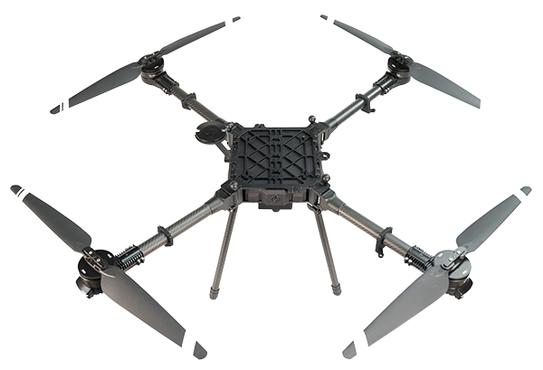

# Introduction

<figure><figcaption></figcaption></figure>

Aurora is the all-purpose Quadcopter designed to carry out complex tasks in various real-world conditions. Equipped with motors mounted around its core frame at equal intervals, the multirotor sUAS utilizes carbon fiber booms and a unique folding mechanism for both booms and propellers. The aviation-grade machined aluminum airframe houses an inner sealed compartment that contains avionics and supporting equipment. It also comes with aluminum bottom plates with data and power ports to cater to the operator's battery/payload integration needs. \
\
Aurora's integral Iso Mounting payload allows easy integration of payloads at the bottom of the airframe. Aurora can accommodate various battery capacities and configurations. The Auterion Skynode Flight-controlled version serves as the flight controller for Aurora, offering a range of features and capabilities. Custom ground control software manages commands and controls through a handheld controller, providing a direct connection to Aurora and real-time telemetry data for the safe direct-link operation of the sUAS. \
\
&#x20;Each CamFlite sUAS is handcrafted with care in our New Jersey facility, with each subsystem undergoing rigorous testing before installation. Before delivery, we repeatedly test-fly each CamFlite sUAS to ensure it meets or exceeds published performance standards and is airworthy.
