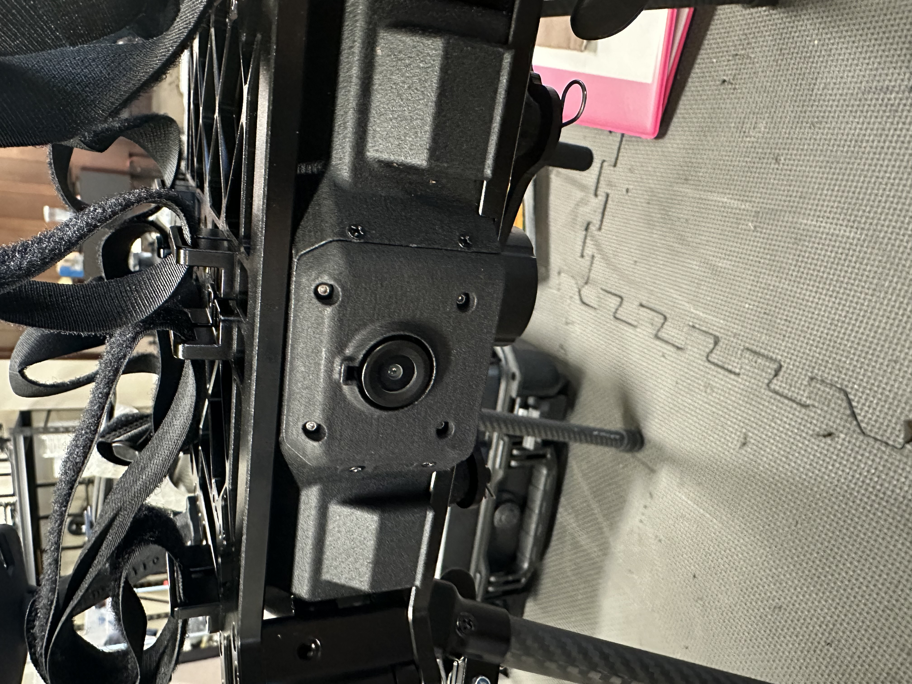
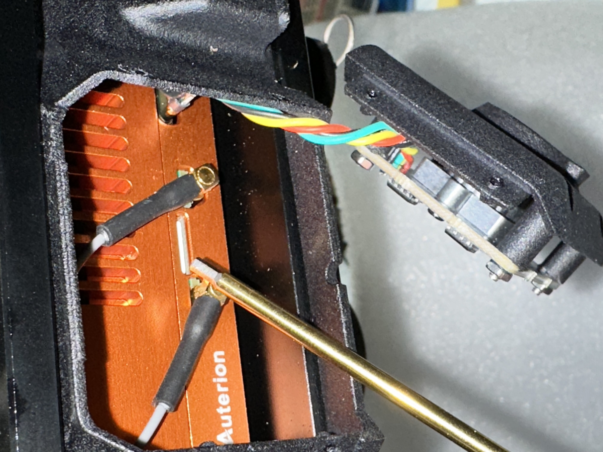
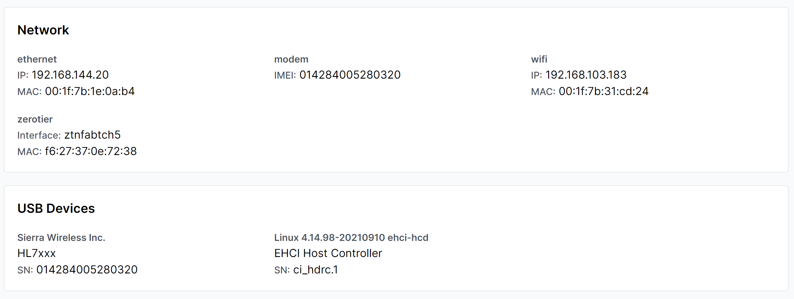

# Network and Connectivity

This section describes the connection process for Aurora s built-in wifi chip. This functionality is helpful while the aircraft is on the ground for admin and setup tasks. Connecting the Aurora to wifi is required to complete the initial [Auterion Suite setup process](broken-reference).&#x20;

## Connect the Aurora aircraft to a wifi network.

* Open AMC Herelink or PC. If using a PC, connect to Aurora with a USB-C cable.
* Power Aurora.
* Tap the icon in the top-left of AMC. Navigate to Vehicle Setup > WiFi
* Select Station mode, which allows Aurora to connect to another wifi network.
* Enter the login credentials for your wifi access point.&#x20;


Unlike the Herelink wifi, which is restricted to the 5GHz band, the Aurora wifi chip is compatible with 5GHz and 2.4GHz bands.&#x20;


### Connect to the Aurora hotspot via wifi.

* Open AMC Herelink or PC. If using a PC, connect to Aurora with a USB-C cable
* Power Aurora.
* Tap the icon in the top-left of AMC. Navigate to Vehicle Setup > WiFi.
* Select Access Point mode, which allows Aurora to broadcast a wifi network that other devices can connect to.

## LTE

The Aurora has an LTE sim card installed, and you can utilize online features such as live video, real-time aircraft status, and flight logs through [Auterion Suite](broken-reference).&#x20;


Aurora is only available with an LTE radio suitable for North American markets.&#x20;


## **LTE Card Installation**

The Aurora comes with a pre-installed LTE card. To replace it, follow these steps:

**Step 1**

To remove the bezel, start by unscrewing the two self-tapping screws positioned around it.

<figure><figcaption></figcaption></figure>

**Step 2**

Once the screws are removed, you will gain access to the SIM card. Simply press the card to eject it.

<figure><figcaption></figcaption></figure>

**Step 4**

Replace the bezel and screw in the 4 screws, making sure not to overtighten them..

### Configure and Enable / Disable

* Install a SIM card into Aurora. Make sure to write down the SIM card number found on the card if you don't have it recorded elsewhere.&#x20;
* Open AMC Herelink or PC
* Navigate to Vehicle Setup > Cellular.
* If you need to access the IMEI number for the vehicle to enable the SIM cards, connect to the Aurora with a laptop and USB cable
  1. Power on Aurora with one battery only.
  2. Connect the laptop and the Aurora by plugging in a USB-C cable to the IO panel on the underside of the aircraft.
  3. Using a web browser, navigate to [http://10.41.1.1/](http://10.41.1.1/) to connect to your Aurora aircraft
  4. On the bottom of the page, expand the "details" bar and scroll until you find the listed IMEI information.

<figure><figcaption></figcaption></figure>

### Frequencies and Compatibility

| Region        | 4G LTE Bands         | Radio Spec Sheet                                                                                                                                                                                                       |
| ------------- | -------------------- | ---------------------------------------------------------------------------------------------------------------------------------------------------------------------------------------------------------------------- |
| North America | B2, B4, B5, B13, B17 | [https://www.sierrawireless.com/products-and-solutions/embedded-solutions/products/hl7588-accessory-board/](https://www.sierrawireless.com/products-and-solutions/embedded-solutions/products/hl7588-accessory-board/) |
|               |                      |                                                                                                                                                                                                                        |
|               |                      |                                                                                                                                                                                                                        |

### Changing SIM / Service Provider

When switching SIM cards, try leaving the APN field blank. It should be automatically detected. If not, here are a few suggestions.

| Carrier  | APN                                                                                                                 |
| -------- | ------------------------------------------------------------------------------------------------------------------- |
| T-mobile | iot.tmowholesale, fast.t-mobile.com                                                                                 |
| Orange   | orange.m2m.spec                                                                                                     |
| Verizon  | see: [https://www.verizon.com/support/knowledge-base-46578/](https://www.verizon.com/support/knowledge-base-46578/) |

In most cases, check the "Allow Roaming" box.

After changing the SIM, reboot both the aircraft and AMC.
