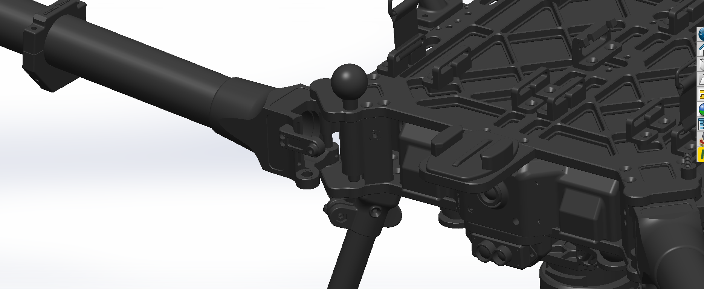

# Motor Booms

The Aurora boasts a unique boom mount and locking mechanism. To secure or release the boom, one can effortlessly tug on the round ball, causing a spring-loaded pin to activate the boom's locking mount. After undergoing hundreds of hours of rigorous testing, no malfunctions have been reported during flight.


To prevent any harm or damage to the locking pin, it is crucial to make sure that the unlocked boom does not swing and hit the pin while it is in the down position.



When new, the locking pin may feel stiff. It is crucial to ensure that the pin is fully engaged and bottomed out. This can be achieved by pushing and rotating clockwise.


<figure><figcaption></figcaption></figure>

## Propellors&#x20;

Ensure that the propellers are not loose; the bolt attachment screws should be securely tightened to allow the propellers to slide but not flop. Regular inspection must be performed to check for any damage to any part of the propellers.

