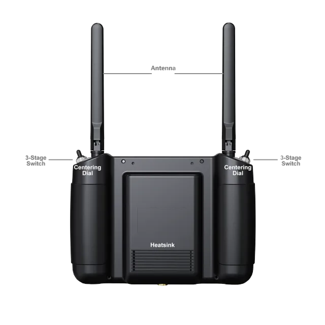

# Non-NDAA Controller

The Camflite MK15 controller in your Aurora is a sophisticated device developed to provide advanced control features. It has been specifically designed to work with your Aurora and comes with special software enabling you to operate it to its full potential. The software allows you to access a range of unavailable features with other controllers, giving you more control over your Aurora's functions. With the Camflite MK15 controller, you can adjust the settings of your Aurora according to your preferences and optimize its performance. Whether you want to dim the lights, change the temperature, or adjust the fan speed, the Camflite MK15 controller makes it all possible. So, enjoy the benefits of this powerful device and make the most out of your Aurora.

## Controller Features&#x20;

<figure><figcaption></figcaption></figure>

<figure><figcaption></figcaption></figure>

## Battery&#x20;

The MK15 transmitter comes with a built-in rechargeable battery of 10200mAh and a 20W PD fast charger. Please read the precautions carefully before using or charging the battery. Make sure to turn off the MK15 transmitter before charging, as it does not allow charging while it's in use.&#x20;

Stop charging immediately if you notice that the charger is damaged, broken, or overheated. Similarly, if you smell something odd, see smoke, or leak, stop charging and send the transmitter back to your dealer for after-sales service. **Moreover, avoid charging the transmitter when the temperature is high or when the battery temperature is over 60℃.**


Please power off the MK15 transmitter before charging.



The transmitter must not be charged while in use. Stop charging immediately if the charger is damaged, broken or overheated.



If you notice any strange smells, smoke, or leaks while charging, please stop the charging immediately.



In case of any issues, please return the transmitter to your dealer for after-sales service..



It is important not to charge the transmitter when the temperature is high or when the battery temperature is over 60℃.


## Super Long Battery Life, 30W PD Fast Charging

The MK15 transmitter is equipped with high-capacity li-on batteries that provide excellent performance. These batteries have a stable and efficient discharging curve, ensuring the system's stability when operating at high speeds. The battery life of the MK15 transmitter is up to 12 hours. Additionally, the transmitter supports a max 30W PD fast charging, which can charge up to 95% of the battery level in just three hours.

## Memory Card (SD/TF)

The MK15 transmitter features a memory card slot at the bottom that can read and write to high-speed SD/TF cards.

## How to Use SIM Card on MK15

MK15 supports 4G network. Insert a SIM card to activate the function. Prior to insertion, check if your local cell network is supported.

<table><thead><tr><th width="119">Channel No.</th><th>Physical Channel Type</th><th>Default Mapping</th><th>Remark</th></tr></thead><tbody><tr><td>1</td><td>Aileron</td><td>Joystick J1</td><td></td></tr><tr><td>2</td><td>Elevator (Mode 2)</td><td>Joystick J1</td><td></td></tr><tr><td>3</td><td>Throttle (Mode 2)</td><td>Joystick J1</td><td></td></tr><tr><td>4</td><td>Rudder</td><td>Joystick J1</td><td></td></tr><tr><td>5</td><td>Flight Mode</td><td>3-Stage Switch SA</td><td></td></tr><tr><td>6</td><td></td><td>3-Stage Switch SB</td><td></td></tr><tr><td>7</td><td></td><td>3-Stage Switch SC</td><td></td></tr><tr><td>8</td><td></td><td>Button A</td><td></td></tr><tr><td>9</td><td></td><td>Button B</td><td></td></tr><tr><td>10</td><td></td><td>Button C</td><td>PWM 1</td></tr><tr><td>11</td><td></td><td>Button D</td><td>PWM 2</td></tr><tr><td>12</td><td></td><td>Left Dial LD</td><td>PWM 3</td></tr><tr><td>13</td><td></td><td>Right Dial RD</td><td>PWM 4</td></tr><tr><td>14</td><td></td><td></td><td>PWM 5</td></tr><tr><td>15</td><td></td><td></td><td>Searchlight A</td></tr><tr><td>16</td><td></td><td></td><td>Searchlight B</td></tr></tbody></table>

## Specifications&#x20;

Channels 13 physical, 16 communicational Datalink

&#x20;Videolink Supported GCS (Standard RTSP video stream) QGroundControl MissionPlanner

Pro Transmitter (Ground Unit) Monitor 5.5-inch High Definition and High Brightness LCD Touchscreen System.

Android 9.0 2G RAM, 16G ROM

Dimension (Antenna Folded) 189 x 138 x 41 mm

&#x20;Weight 850 g

Battery Capacity & Type 10200 mAh 7.4V 2S Li-on Fast Charging Protocol PD 30W Battery Life 15 hours

&#x20;Interface & Ports Charging: Type-C Firmware Upgrade:

&#x20;DATA (4-Pin) Mobile Network: SIM Card Slot External

Storage: TF Card Slot Tripod Connect: 1/4-inch Screw Hole

Video Output: Standard HDMI External RTK: DATA (4-Pin)

Data Transfer: USB-A

Waterproof Level IP53

&#x20;Working Temperature -10℃ \~ 55℃   MK15

## Indicator Definition

The MK15 transmitter and receiver use three different colored status indicators that blink at different frequencies to indicate working or abnormal status.

<figure><figcaption></figcaption></figure>

## Power On/Off

To power the MK15 transmitter, you must perform a short and long press combo. To do this, press the power button once when the transmitter is off, and the battery level indicators will light up. Then, immediately press and hold the power button for about two seconds. The battery indicators will light up again, but this time one by one. This indicates that the transmitter is powered on.\
\
To power off the MK15 transmitter, you need to perform a long press. Press and hold the power button for about two seconds when the transmitter works. This will prompt the Android system to open a window with icons. Locate the power off icon and touch it to power off the MK15 transmitter.

&#x20;


Forced Shutdown: When the MK15 transmitter is working, press and hold the power button for about eight seconds, transmitter power will be forced to shut down.


## Charging&#x20;

You can charge the MK15 transmitter only when it is powered off and using the original PD fast charger.

Steps:

1\. Connect the MK15 transmitter to the PD charger and plug it into the power supply.&#x20;

2\. The charging indicator lights up red, and the transmitter starts charging.&#x20;

3\. When the charging indicator turns green, charging is finished.


A normal 5V charger adapter cannot charge the MK15 transmitter. Please use the SIYI original PD fast charger. MK15 transmitter cannot be charged when it is working. Please power off the transmitter before charging.


## How to Place MK15 Antennas

As shown in the photo below, the transmitter antenna should be placed vertically from the monitor, the head should point upward, and its flat side should always point to your aircraft or vehicle.

<figure><figcaption></figcaption></figure>


The two transmitter antennas should not be overlapped.


## FCC STATEMENT

This device complies with Part 15 of the FCC Rules. Operation is subject to the following two conditions:&#x20;

(1)This device may not cause harmful interference, and&#x20;

(2)This device must accept any interference received, including interference that may cause undesired operation.

NOTE: This equipment has been tested and found to comply with the limits for a Class B digital device, according to Part 15 of the FCC Rules. These limits are designed to protect reasonably against harmful interference in a residential installation. This equipment generates uses and can radiate radio frequency energy and, if not installed and used following the instructions, may cause harmful interference to radio communications. However, there is no guarantee that interference will not occur in a particular installation. Suppose this equipment does cause harmful interference to radio or television reception, which can be determined by turning the equipment off and on. In that case, the user is encouraged to try to correct the interference by one or more of the following measures: MK15 User Manual V1.1 85 2021 SIYI Technology, All Rights Reserved Reorient, or relocate the receiving antenna. Increase the separation between the equipment and the receiver. Connect the equipment to an outlet on a circuit different from that to which the receiver is connected. Consult the dealer or an experienced radio/TV technician for help.

