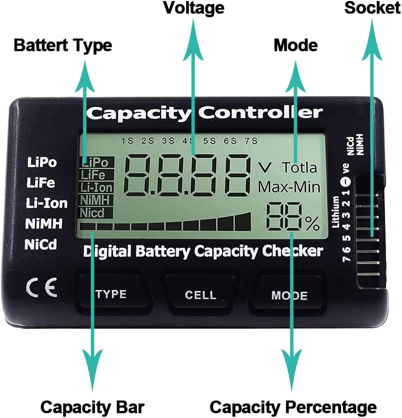
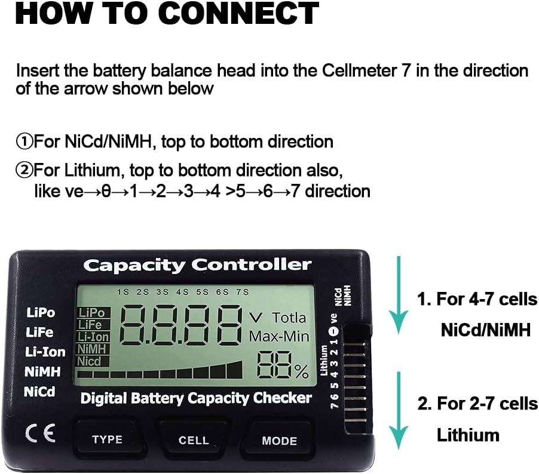

# Powering

To ensure top-notch performance, it is recommended to use lipos with a capacity ranging from 16ah to 25ah, with an X90 connector rated at 22.2V, as the Aurora UAS can accommodate different sizes of lipos. It requires two 6s lipos to power up the drone, and force is unnecessary when plugging in the battery.

**Apply the provided Rubber foam to the bottom of each battery. That and the sinch strap is all that is needed to keep the battery in place. This lightweight solution has proven to be a foolproof method of attaching the batteries to the airframe.**  &#x20;


Aurora uses standard LiPo 22.2v batteries, not HV LiPos with 22.8v. However, you can use HV LiPos if you charge them as a standard LiPo.



It is important to ensure that the batteries do not slide around, so attaching a self-adhesive neoprene rubber to the bottom of each battery is recommended. It is not necessary to tighten the battery straps excessively.


<figure><figcaption></figcaption></figure>


The connection of batteries results in full power for both the drone and the payload.



Please ensure that you wait at least 30 seconds before repowering after removing the power. Some capacitors need to discharge fully.


## Battery Charge Status

Battery Voltage Gauge&#x20;

&#x20;Connect the Battery Balance cable to the Battery Voltage indicator to check the battery voltage. Ensure the red wire is closest to the bottom of the voltage indicator when plugging the balance cable.&#x20;

The balance plug's plastic guides should face the pilot while plugging it in.&#x20;

A fully charged battery will show a 25 to 25.29-volt voltage reading.

<figure><figcaption></figcaption></figure>

<figure><figcaption></figcaption></figure>

To check battery status or remaining flight time, the pilot must understand how to gauge the remaining flight time.&#x20;


The battery voltage will fluctuate between 50 and 42 volts.



Full Battery = 50 volts b. Empty Battery = 42 volts&#x20;


Drone batteries are usually made of lithium polymers, and their depletion is exponential. These batteries work best when their capacity is between 100% and 30%. However, if the battery goes below a certain voltage level or percentage, it can lose power quickly, resulting in a crash. To avoid this, pilots must keep a close eye on the battery voltage throughout the flight to know how much flight time they have left.
