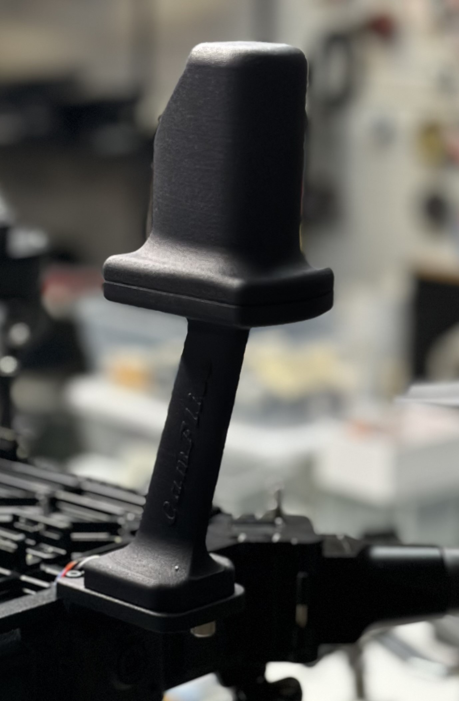
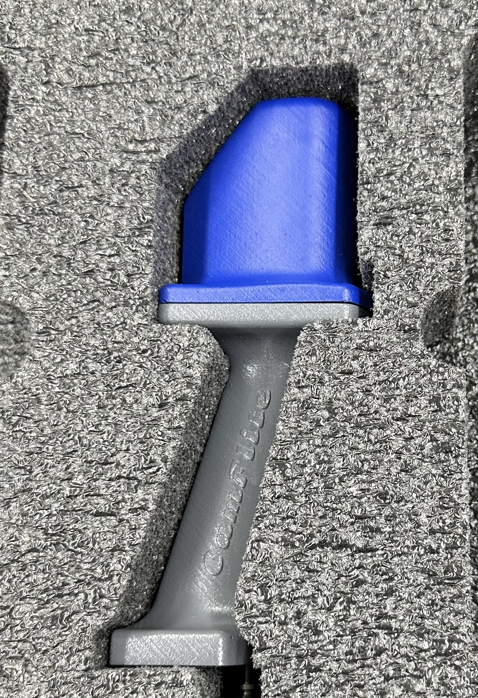

# RTK GPS Mast Installation

You can find the RTK GPS inside a compartment provided in the case. Slide the RTK GPS mast onto the dovetail mount base at the UAS's front. A Pogo pin connection provides a solid connection to the RTK GPS to FMU.  The RTK GPS is an ARK RTK GPS using an F9P module.&#x20;


Make sure the thumb screw is backed out enough to allow the RTK GPS to slide in before tightening the thumb screw.


<figure><figcaption></figcaption></figure>


If there are no GPS satellites visible in the GCS after installing the RTK antenna, do not fly. Check to ensure that there is no damage to the connection. If there is any damage, contact Camflite.


<figure><figcaption></figcaption></figure>

