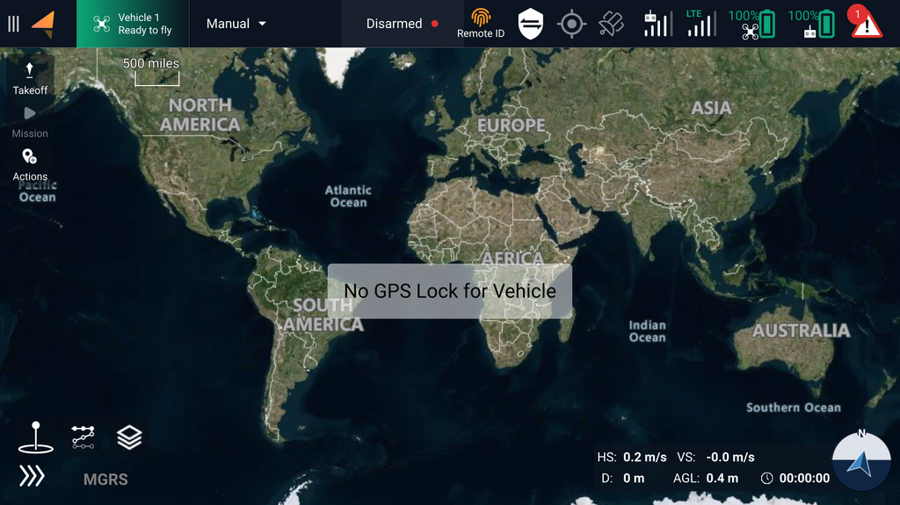
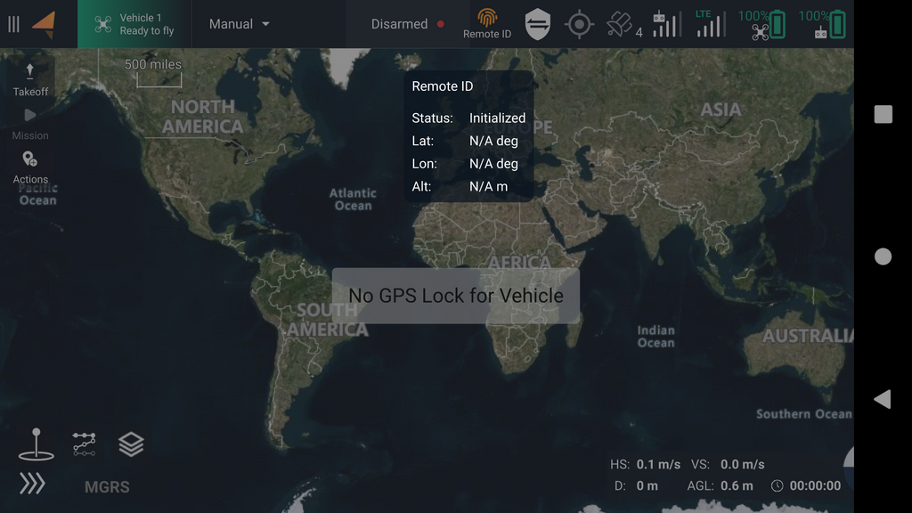
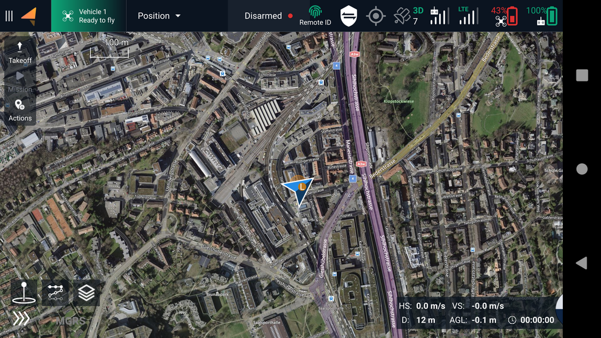
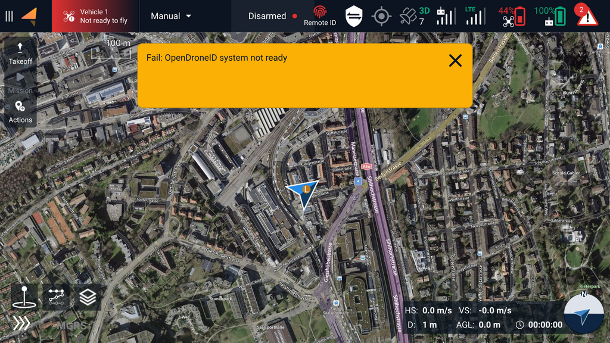

# Remote ID indicators in AMC

### Orange icon: Initialization

<figure><figcaption></figcaption></figure>

The orange icon indicates that the Remote ID system is in the initialization state. The Remote ID application on Skynode has not yet received any messages from either APX4 and AMC. If this state persists, there are two likely reasons:

1. The GCS has no position fix, either because the sensor is missing or disabled, or because the signal quality is not good enough.
2. APX4 is not communicating with the Remote ID application in AuterionOS. This should only happen during development when the APX4 version is not up to date.

The GCS position can be checked by tapping the Remote ID icon in AMC. If the Lat, Lon and Alt fields are populated, this means that the GCS is good to go and waiting for the drone to finish initialization. An example is shown in the screenshot below:

<figure><figcaption></figcaption></figure>

### Green Icon: Healthy

<figure><figcaption></figcaption></figure>

A green icon indicates that the Remote ID system is healthy and the drone is ready to fly.

### Red Icon: Failure

<figure><figcaption></figcaption></figure>

The failure state is entered if the Remote ID system was healthy at one point and then encountered an error during operation. One reason might be that Remote ID stopped receiving a heartbeat from either AMC or APX4

### Grey Icon: Not enabled or not supported

A grey Remote ID icon in AMC means that Remote ID has either not yet been enabled or the AuterionOS version installed on the vehicle does not have support for it.&#x20;
