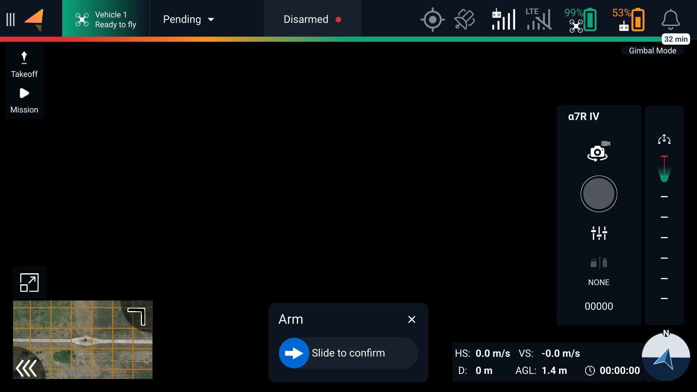
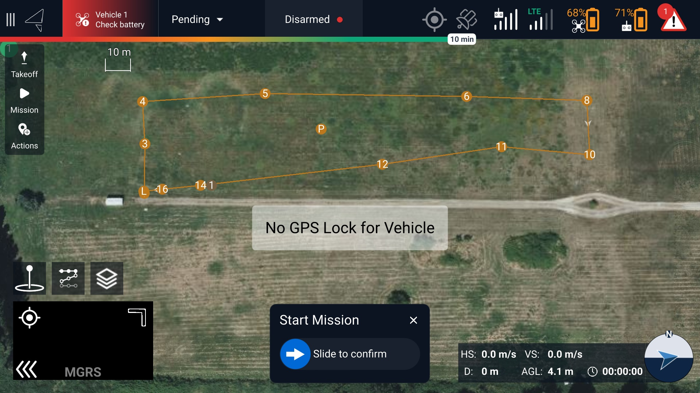
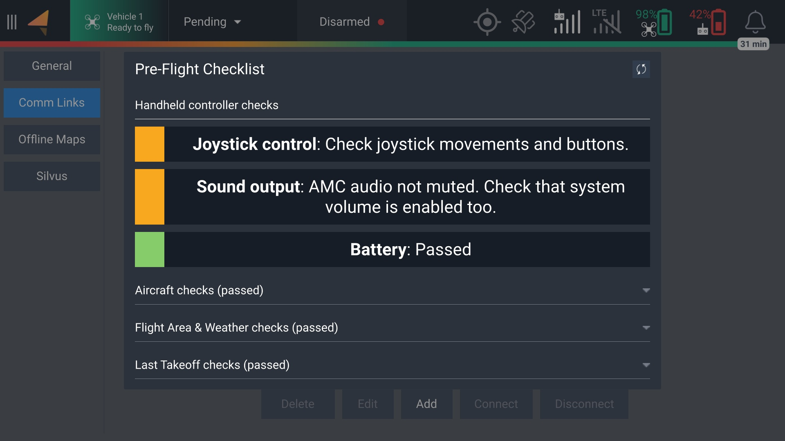
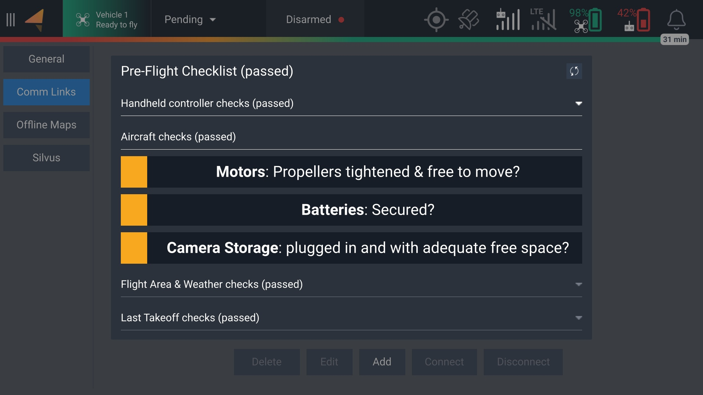
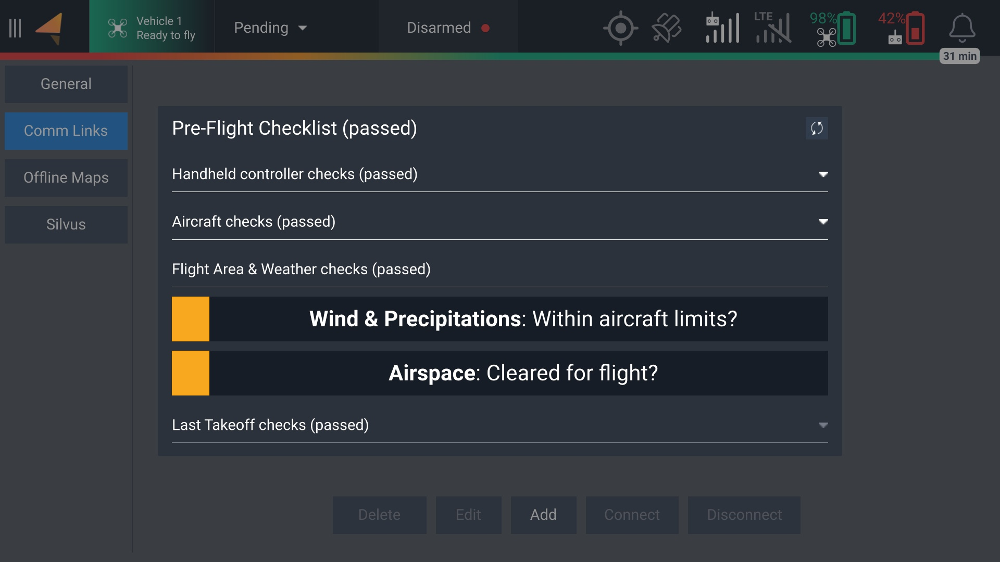
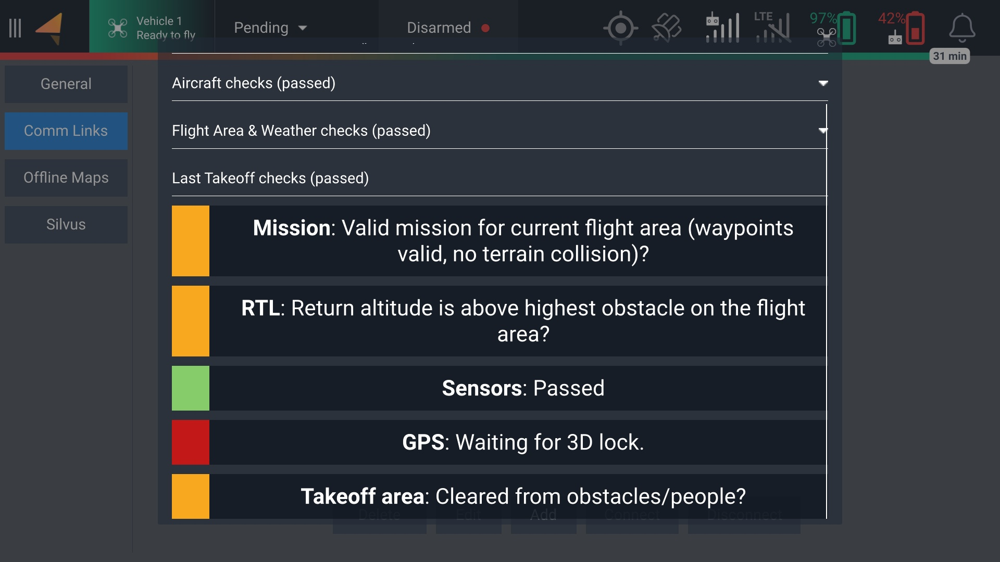

# Fly

## Camera View

This screen includes a live camera feed, telemetry, and camera/gimbal control. You can also launch uploaded missions or take off using the touch screen.

<figure><figcaption></figcaption></figure>

## Map View

This screen displays the nearby satellite map and the current mission if uploaded.&#x20;

<figure><figcaption></figcaption></figure>

## Pre-Flight Checklist

There is an optional checklist that can help you ensure the safety of your flight. This checklist can be accessed by tapping the Vehicle box located on the top-left corner of your screen. You can manually verify each item before takeoff by tapping on the yellow boxes, which will turn green once verified. \
\
If there is a warning or error, it will be indicated by a red item on the checklist. Some items are crucial and will prevent takeoff, such as insufficient battery power, while others will allow for takeoff with some limited usage. For example, if there is no GPS signal, the aircraft will only be capable of taking off in Manual mode.

<figure><figcaption></figcaption></figure>

<figure><figcaption></figcaption></figure>

<figure><figcaption></figcaption></figure>

<figure><figcaption></figcaption></figure>

