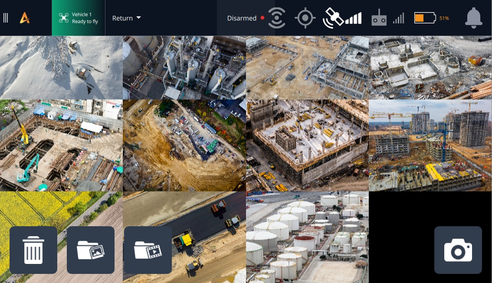
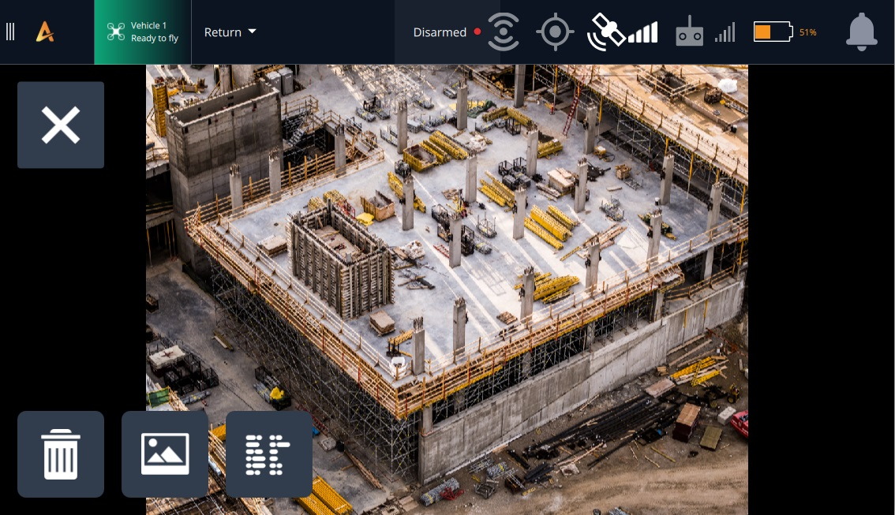

# Photos

_Photos View_  ([**Menu > Photos**](broken-reference)) provides a convenient way to view images from the vehicle.

<figure><figcaption></figcaption></figure>

## Gallery View

The gallery view displays a grid of thumbnail images for downloaded photos. Individual thumbnails can be [selected](broken-reference) to view the image in greater detail.&#x20;

<figure><figcaption></figcaption></figure>

The gallery can be scrolled and images re-sized using the normal mechanisms for the ground station operating system (e.g. drag, pinch, etc.). &#x20;

Select (short-press) a thumbnail to open the photo full-screen in the image viewer. Long-press any thumbnail to start multi-image selection in preparation for deleting multiple images.

There are also buttons to open the operating system folders containing photos and videos.

| Icon                                                            | Name              | Description                                                                                                                                                                                                             |
| --------------------------------------------------------------- | ----------------- | ----------------------------------------------------------------------------------------------------------------------------------------------------------------------------------------------------------------------- |
|                | **Capture**       | Take a photo.                                                                                                                                                                                                           |
|   | **Photos Folder** | Open the folder containing captured photos in the native file system.                                                                                                                                                   |
|  | **Videos Folder** | Open the folder containing captured videos in the native file system.                                                                                                                                                   |
|                | **Delete**        | 
Deletes selected image(s).

 The first image is selected using long-press on any image; after which checkboxes appear that can be used to select other images.

 |

## Image Viewer

<figure><figcaption></figcaption></figure>

Buttons are provided to view image metadata, open it in the default OS image viewer, and delete the file.

| Icon                  | Name                    | Description                                                                    |
| --------------------- | ----------------------- | ------------------------------------------------------------------------------ |
|  | **Close**               | Close image viewer (return to gallery).                                        |
|  | **Delete**              | Delete image.                                                                  |
|  | **System Image Viewer** | Open image in the default image viewer for the  operating system               |
|  | **Toggle Data**         | 
Toggle image metadata on/off.

 |
