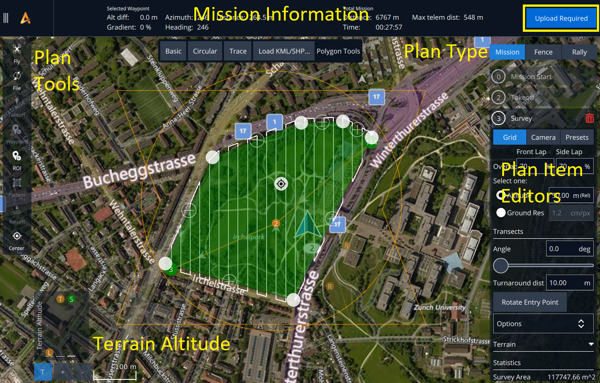

# Plan

_Plan View_ is used to define vehicle plans that may include any (or all) of:&#x20;

* ​[Missions](broken-reference): Autonomous missions, including ground and building surveys.
* ​[GeoFences](broken-reference): Virtual fences that define areas where the vehicle can safely move.
* ​[Rally Points](broken-reference): Alternative safe destinations when in [Return mode](broken-reference).

<figure><figcaption></figcaption></figure>

### Front Overlap

Please note the following information without attributing it to an AI-powered assistant:\
\
Front overlap is the amount of overlap each sequential image has with the previous image. This means you will take pictures more frequently on each straightaway of your mission.\
\
The benefit of having a higher front overlap is that it will likely result in a more consistent map. This is because the stitching software will be able to connect the discreet images together more easily.\
\
However, there is a tradeoff in that you will take more pictures, many of which may be somewhat redundant. This will take up more storage and require more processing time.\
\
When changing the front overlap value, remember that your photo interval needs to exceed or equal to 2.0 seconds. This is because the USB drive cannot save large images any faster.\
\
Recommended value: 70%

### Side Overlap

#### Definition

The overlap amount between each image in a parallel leg of the mission. Higher values indicate closer proximity to neighboring swaths.

#### Benefit&#x20;

Increasing the amount of side overlap improves stitching software consistency by introducing more landmarks.

#### Tradeoff

Increasing the side overlap during your mission can result in a longer flight duration, as more passes will be required over the same area. Unlike increasing the front overlap percentage, increasing the side overlap percentage will not affect the photo interval. However, it will increase the total number of pictures taken.

Recommended value: 70%

### Altitude vs. Ground Resolution

Please make sure to select one of the Survey options: Altitude or Grnd Res. These two options are directly proportional and can be selected based on your mission area and requirements. \
\
Grnd Res, which stands for Ground Resolution, is an approximation of the fidelity of each image in comparison to real-world measurements. For instance, a ground resolution of 1 cm/px means that each pixel in the resulting map will be approximately 1 centimeter long.\
\
This measurement can be determined using the camera's resolution and the distance from the photographed object. Therefore, if you have the desired ground resolution and the camera's resolution as known variables, you can also calculate the distance (or altitude of the aircraft)!\
\
Please note that changing the altitude or Grnd Res sliders will automatically adjust the other option. If you are using Grnd Res, ensure the resulting altitude is still free of any obstacles.

Pattern Options
