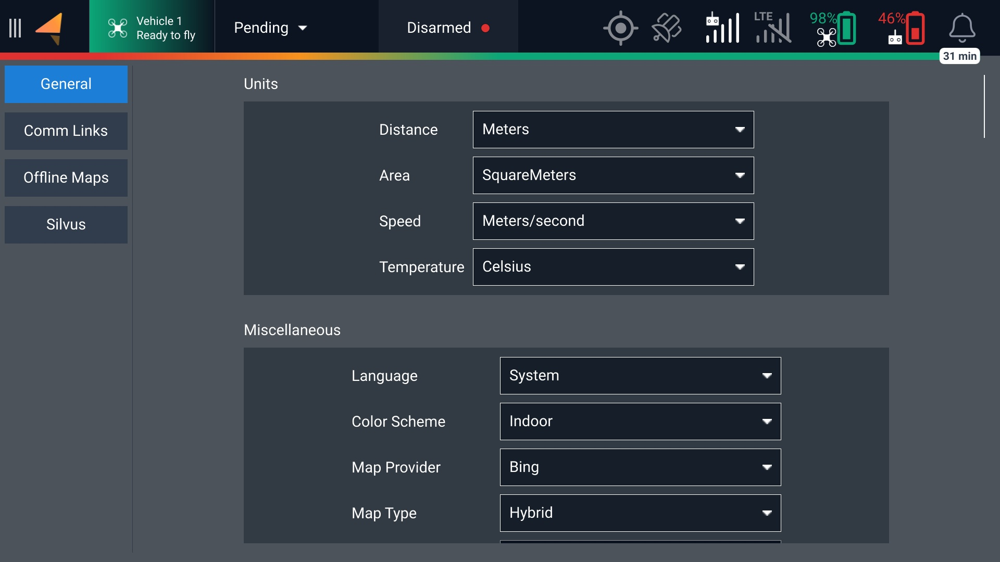
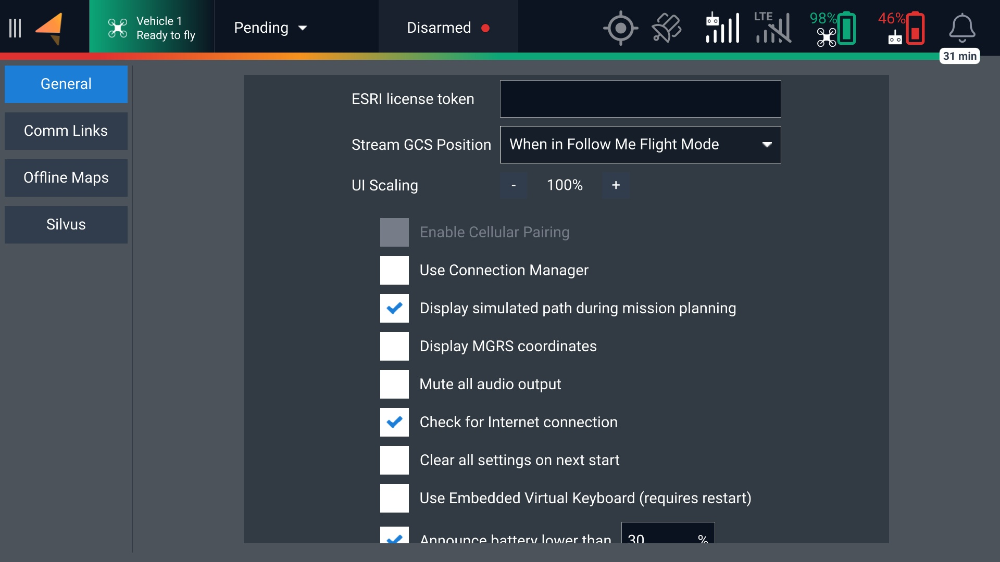
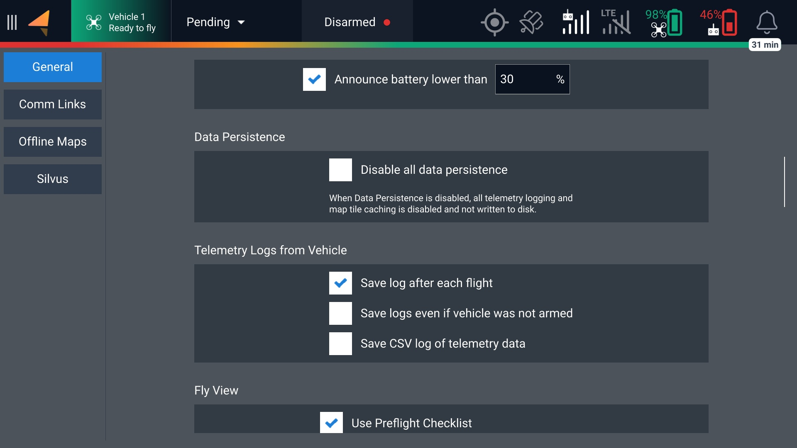
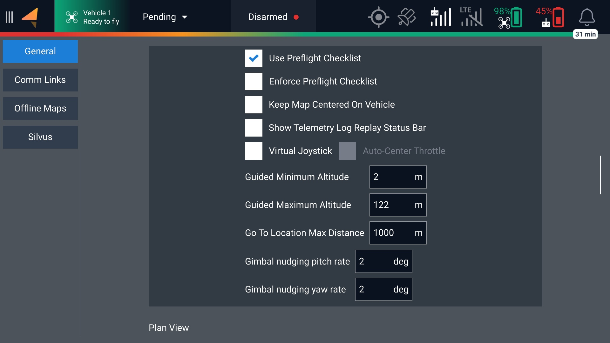
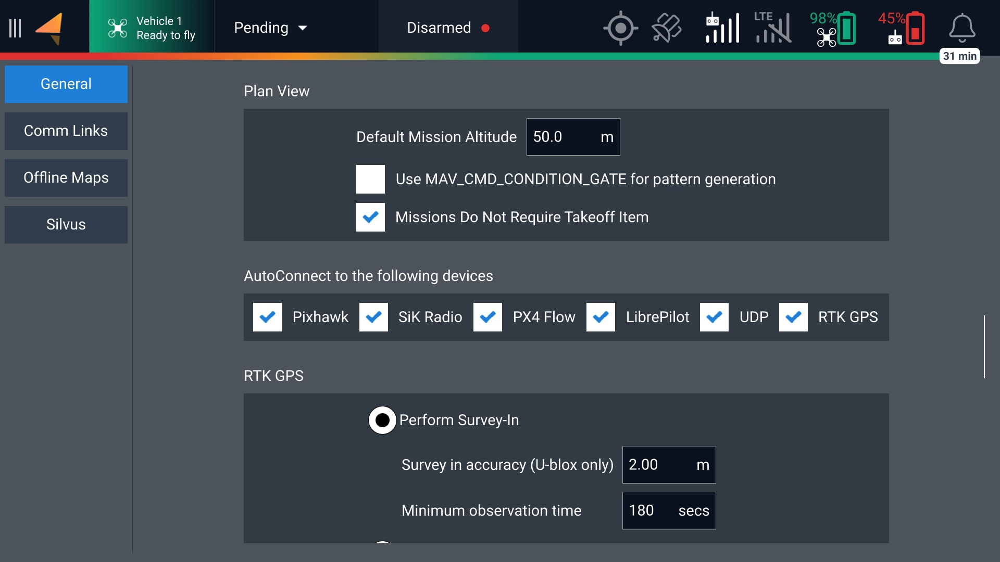
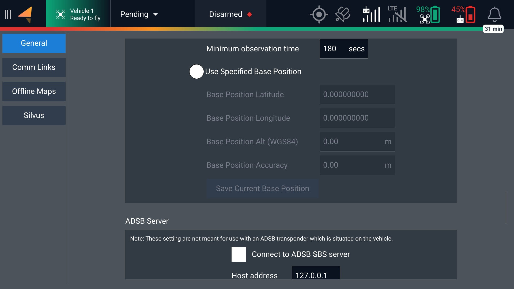
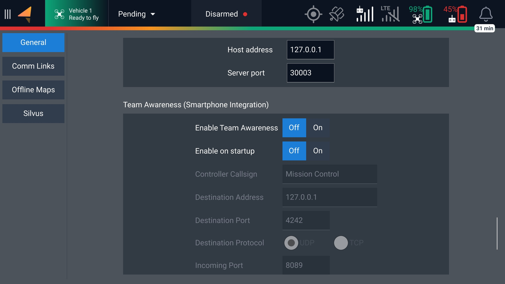
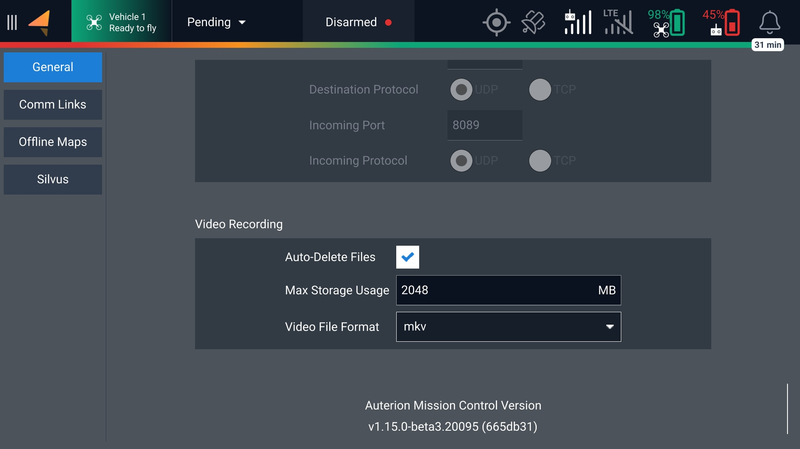
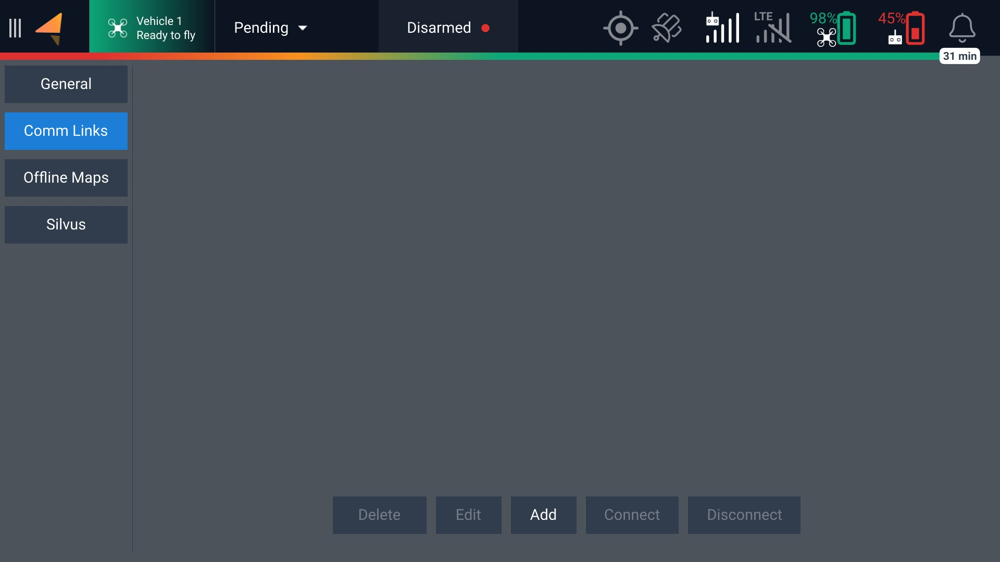
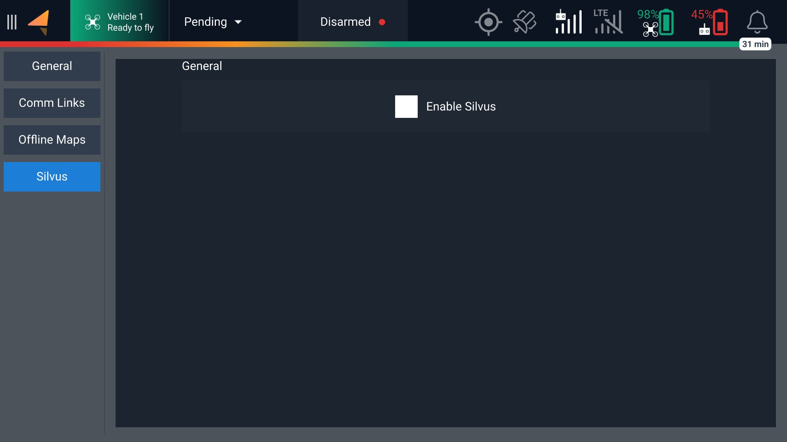

# Settings

## General

<figure><figcaption></figcaption></figure>

<figure><figcaption></figcaption></figure>

<figure><figcaption></figcaption></figure>

<figure><figcaption></figcaption></figure>

<figure><figcaption></figcaption></figure>

<figure><figcaption></figcaption></figure>

<figure><figcaption></figcaption></figure>

<figure><figcaption></figcaption></figure>

## Com Links

<figure><figcaption></figcaption></figure>

## Silvus

<figure><figcaption></figcaption></figure>
