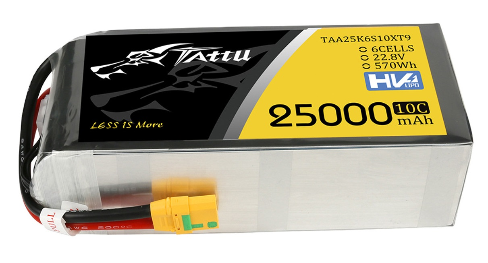

# Batteries

The Aurora UAS is capable of accommodating various sizes of lipos. For optimal performance, we suggest using lipos with a capacity of 10ah to 30ah, 22.2V, and an X90 connector. Two 6s lipos need to plug in to power up the drone. Our battery solution offers affordable proprietary batteries and empowers our customers with the freedom to choose from a range of sizes, brands, and prices.


When utilizing HV Lipo batteries, it is crucial to charge them similarly to regular Lipo batteries by using the standard Lipo charge setting. This is because HV Lipo batteries necessitate a higher voltage of 4.4v per cell. Additionally, it's worth noting that Aurora employs motors that can operate up to a maximum of 52.2v.


<figure><figcaption>
Battiers Mounted using provided straps.
</figcaption></figure>


During installation, it is crucial to ensure that the power wires do not come into contact with the spinning propellers.


<figure><figcaption>
Typical Reccommend lipo.
</figcaption></figure>

To ensure safety when using LiPo batteries, avoiding incorrect chargers and voltage cutoffs and discharging them beyond their capacity is important. Fortunately, advancements in battery technology have made LiPo batteries a reliable and safe power source. To maximize safety, it's recommended to follow a few simple rules.

• Always store batteries in a fire-safe container.\
• Always charge with an appropriate charger designed for LiPos.\
• Always follow the manufacturer’s instructions for charging and discharging rates.\
• Always size a pack according to its usage.\
• Never overcharge.\
• Never over-discharge.\
• Never use a puffed pack.\
• Never use a pack with visible damage (dents, cracks, etc).\
• Never charge a pack unattended.\
• Never disassemble or reconfigure a damaged pack.


Many accidents involving LiPo packs occur due to failure to adhere to safety regulations. It is crucial to thoroughly comprehend the charger you are using and adhere to the manufacturer's instructions to ensure safe charging practices. Stay safe.


Battery Guidelines and Warnings&#x20;

\*Read these safety instructions and warnings before using or charging your batteries.&#x20;

\*Lithium Polymer batteries are volatile. Failure to read and follow these instructions may result in fire, personal injury, and property damage. Do not charge/ discharge a battery inside your house, garage, building, or vehicle.&#x20;

\*Tattu and its distributors and retailers assume no liability for failure to comply with these warnings and safety guidelines.&#x20;

\*By purchasing this battery, the buyer assumes all risks associated with this product. If you do not agree with these conditions, please return the battery immediately before use. Before charging/ discharging:&#x20;

1\. Inspect the battery for any damages. Do not charge a damaged battery.&#x20;

2\. Inspect the battery for any swelling. Do not charge a swellen battery.&#x20;

3\. Inspect the battery for possible battery fluid leaks. Do not charge a leaking battery.&#x20;

4\. Inspect the voltage for each battery cell. If the cell voltage is significantly lower than the normal voltage(3.3V per cell) or the voltage of each cell has a significant difference, The battery may be in defective condition. Do not charge the battery.&#x20;

5\. Make sure the wire connection polarity is correct; do not short circuit the battery.&#x20;

6\. Verify the lithium polymer charger is in good condition. Charging/ discharging the battery: Please follow below instructions to setup the charging station.&#x20;

Failure to do so will cause a fire, which may result in serious personal injury and property damage. 1. Use a fireproof cement concrete bunker or fireproof material flower pot as the charging container.

&#x20;2\. Put the charging container on a cement concrete floor.&#x20;

3\. The horizontal clearance radius for the charging container should be at least 5 feet.

4\. The vertical clearance for the charging container should be at least 10 feet.&#x20;

5\. Cover the charging container with a fireproof material cover.&#x20;

6\. Never leave while battery is in charging process. Do not charge the battery unattended.&#x20;

7\. In case of fire. disconnect the electrical wire from the electrical outlet immediately. 8. Do not put any combustible materials near the charging area.

&#x20;Storing the battery: Please follow below instructions to setup the storing station. Failure to do so will cause a fire, which may result in serious personal injury and property damage.&#x20;

1\. Use a fireproof cement concrete bunker or fireproof material flower pot as the storage container. 2. Put the storage container on a cement concrete floor.&#x20;

3\. The horizontal clearance radius for the storage container should be at least 2 feet.&#x20;

4\. The vertical clearance for the storage container should be at least 10 feet.&#x20;

5\. Cover the storage container with a fireproof material cover.&#x20;

6\. Constantly check the condition of the battery in side the storage container at least once a week.Do not leave the battery unattended for a long period of time.

&#x20;7\. Do not put any combustible materials near the storage container.&#x20;

8\. Store batteries in a location with room temperature only.

&#x20;9\. Verify the battery is in good condition before storage.

&#x20;Using the battery: Using the battery:&#x20;

1\. Inspect the battery for any damages. Do not use a damaged battery.&#x20;

2\. Inspect the battery for swelling. Do not use a swollen battery&#x20;

3\. Inspect the battery for possible battery fluid leaks. Do not use a leaking battery

&#x20;4\. Inspect the voltage for each cell. If the cell voltage is significantly lower than the normal voltage(3. 3V per cell) or voltage of each cell has significant difference, the battery may be in defective condition.Do not use the battery.&#x20;

5\. Make sure the wire connection polarity is correct; do not short circuit the battery Lithum Polymer (Lipo) battery warnings&#x20;

1\. Never charge a lithium polymer battery with a charger designed for NiCd, NiMH, or any other type of battery chemistry. Use ONLY a charger designed for LiPo battery. Failure to do so may cause a fire, resulting in personal injury and property damage.&#x20;

2.Battery charging/discharging and observation should occur in an isolated safe location outside of any building or vehicle and away from any combustible material. The middle of cement driveway is a good example of a safe location. Never charge/discharge the battery inside the house, garage and vehicle&#x20;

3\. It is solely the user's responsibility to ensure that the charger used in the charging/discharging process works properly. Only charge LiPo batteries with a good quality Lithium Polymer balanced charge. Failure to do so may cause a fire, resulting in personal injury and property damage.&#x20;

4\. Inspect the battery before the charging/discharging and storage process. Check for damage, leaks, broken connectors, and puffiness. Check the battery voltage. Normal voltage should be approximately between 3.3V-4.2 per cell. If the voltage is significantly less than the normal voltage(less than 3.3V per cell), do not charge/discharge the pack.&#x20;

5\. The charging rate should not exceed 1C (one time the battery capacity, for example: charging an 800mAh battery at or below 0.8A, charging a 3000mAh battery at or below 3A).Higher charging rate may damage the battery and result in fire.

&#x20;6\. Charge/discharge each battery pack individually. Set the cell count, charging current, and voltage on the charger for the charging/discharging process correctly.&#x20;

7.Do not over charge/discharge the battery: doing so will damage the battery. Do not discharge the battery. Do not discharge a battery pack to a level below 3.3V per cell&#x20;

8.Do not use batteries that lose 20% of their capacity.&#x20;

9.Do not leave LiPo battery unattended during the charging/discharging process. During the charging/discharging process, user should monitor the process constantly and react to potential problem that may occur&#x20;

10.Always place the battery in a fire resistant surface or fire safety container alone when charging/discharging. The middle of a cement driveway is a good example of a safe location. Do not charge/discharge battery inside house, garage, vehicle, building and away from any combustible material.&#x20;

11.Always store the battery in a fire resistant surface or fire safety container alone. Do not store battery inside house, garage, vehicle, building and away from any combustible material.&#x20;

12.Do not continue to use damage battery, Send damage battery to certified recycling facility as soon as possible&#x20;

13.Allow battery to cool down to normal temperature before recharging. Never exceed 140 degrees F during the charging/discharging process.&#x20;

14.Shorts circuit the battery can cause fires! If you accidentally short the battery, you should place the battery in a safe area for observation for approximately 30 minutes.&#x20;

15.Never modify the battery by yourself. If you need to cut the terminal wires, soldering connectors, please consult an experienced user before operation.&#x20;

16.Use the battery with care and avoid puncture to the battery. Puncturing a LiPo battery can cause fire.&#x20;

17.Store batteries at room temperature between 40 to 70 digress F. Never store battery pack inside your vehicle if the internal temperature exceeds 120 degrees F. If storing for a period of time (more than a week), batteries should be stored at 3.8V to 3.9V per cell.&#x20;

18.Never expose battery under direct sunlight or heat for extended periods of time. Expose batteries at temperature greater than 140 degrees F for extended period of time(more than 30 minutes)may result in damage to the batteries and possible fire.&#x20;

19.Inspect batteries if crash, battery should be placed in a safe area for observation for at least 30 minutes after crash. 20.Do not allow LiPo cells to overheat at any time. Cells which reach greater than 140 degrees F will usually become damaged and will catch fire.&#x20;

21.Do not expose LiPo cell to water or moisture at any time. 22.Do not assemble LiPo cells or pre-assembles packs together with other LiPo cells or packs. 23.Always store LiPo battery in a secure location away from children. 24.Always remove the LiPo battery if model is involved in any kind of crash. Carefully inspect the battery and connectors for even for the smallest damage.CATION: cells may be hot! 25.Do not allow the electrolyte to get into eyes or on skin. Wash affected areas immediately if they come into contact with electrolyte. Do not alter or modify connectors or wires of a LiPo battery pack. 26.Do not have contact with a leaky/damaged battery directly. 27.Do not charge/discharge battery at the recommended temperature range(Charge:32 to 110 degrees F; Discharge:32 to 140 Degrees F) 28.Do not charge/discharge process, if at any time you witness a battery starting or swelling up, discontinue the charging/discharging process immediately. Disconnect the battery and place it in a safe observation area for approximately 30 minutes. Continuing to charge a battery that has begun to swell results in fire. By purchasing and using this battery, the buyer and user assume all risks associated with this product. If you do not agree with these conditions, do not proceed to use the battery. You must read the above safety instructions and warnings before charging/discharging your batteries. Manufacturers, distributors, and retailers assume to liability for failure to comply with the warning and safety guidelines. This product is for experienced adult remote control users only. It is not recommended for children under the age of 18.All minors should be accompanied by an adult when operating a Li-Po battery. This product requires proper operating knowledge to avoid any accidents. Failure to take caution when operating this product may result in serious injury or property damage. It is the owner's responsibility to operate this product in a safe manner. Manufacturers and its distributors are not responsible for any bodily injury(s) and/or property damage that may occur from the use of or caused by this product.
