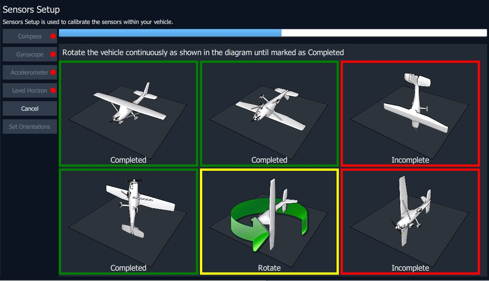

# Calibration and Tuning

## Compass Calibration

To ensure proper functionality, it's important to calibrate all the magnetometers on the vehicle during the compass calibration process. It's recommended to calibrate the compasses during the initial use of the vehicle. In normal conditions, there's no need to calibrate them again unless the vehicle is exposed to a strong magnetic field or operated in an area with unusual magnetic properties.\


Indications of poor compass calibration include circling during hover, "toilet bowling" (spiraling outwards at a constant altitude, leading to the fly-way), or veering off-path when attempting to fly straight.


**The calibration steps are:**

&#x20; 1\. Select the **Vehicle Setup** view and **Sensors > Compass** in the left sidebar.&#x20;

2. Place the vehicle in any of the orientations shown in red (incomplete) and hold it still. Once prompted (the orientation image turns yellow) rotate the vehicle around the specified axis in either/both directions. Once the calibration is complete for the current orientation, the associated image on the screen will turn green.

<figure><figcaption></figcaption></figure>


For optimum results during an Accelerometer Calibration, folding Aurora's arms and placing them on a flat surface in various positions is recommended. Neglecting to do so may lead to problems with the calibration process.



After recalibrating any sensor, make sure to restart Aurora before flying. Some changes may not take effect until you reboot the drone.&#x20;


## Tuning

Aurora is pre-tuned by Camflite and can be flown without changes.&#x20;


Changing the low-level control parameters can be risky, as it may result in instability or control issues that could ultimately lead to a crash. It's best to avoid making such modifications.



If you're ever uncertain about changing the tuning properties, resetting to default parameters or using known-good presets can quickly and safely restore Aurora to its functional state.

