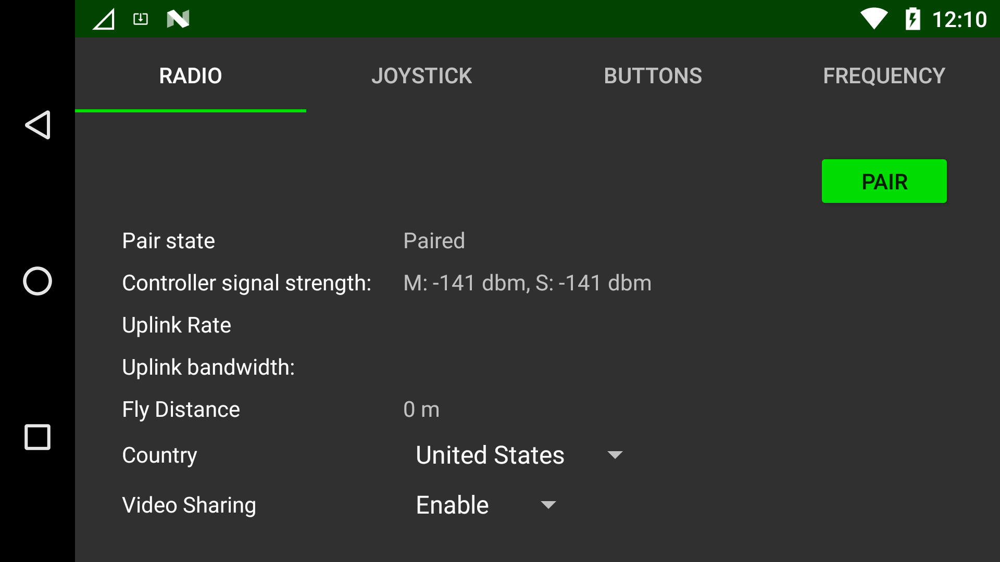

# Herelink Controller Maintenance


It's important to note that Herelink can be purchased from various sources, but we recommend the Aurora version for optimal performance and functionality. It's best to avoid using any ports on the Herelink Air Unit to maintain its optimizations and prevent any potential disabling.\
\
Although the Herelink wiki can be helpful in certain situations, its accuracy may not always be applicable to Aurora. Feel free to reach out to us with any questions or concerns through our website's "Contact Us" page or contact@camflite.com.


## Herelink Binding

Prepare non-metallic tweezers or toothpicks.

Remove the Herelink cover.

Install both batteries on Aurora and activate it.

Turn on the Herelink Pilot Handset.

Use your finger to pull down from the top of the screen and select the Herelink Radio Status message.

<figure><figcaption></figcaption></figure>

On the Herelink Radio page, tap “Pair”.

<figure><figcaption></figcaption></figure>

To pair or reset the Herelink Air Unit, simply use tweezers to press and hold the "Pair/Reset" button until LED2 starts blinking. This usually takes around 3 seconds.

Verify the Herelink Pilot Handset shows a status of "PAIRED" and that the uplink rate is non-zero.

Open the AMC app on Herelink Pilot Handset and verify the connection to the aircraft.\
\
Power off Aurora and Herelink Pilot Handset.

Reinstall the Herelink cover.
