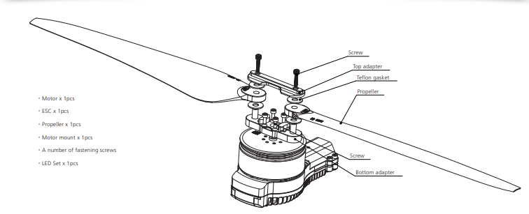

# Motors & Propellers


Any damage to any part of the propeller can lead to a crash, and visual inspection should be done before every flight.


## Propellor maintain procedures&#x20;

• Use the appropriate tools to remove the two screws that fasten the propellers in place. Replace the damaged propellers with new ones, ensuring that they are correctly secured in place using the fastening screws. If you also need to replace the propeller clips, you will have to remove the fastening screws and replace the entire set of propeller clips and propellers.

&#x20;• To install the propeller clip blades, first put the bottom cover on the motor. Then attach the propeller blades, propeller gaskets, upper cover (propeller clips), and the final screws in that order. Make sure you pay attention to the installation of the propeller screws. Once everything is clamped, the propeller should rotate freely. Tighten the propeller clamp and the motor fastening screw, and use screw glue at the same time. This will ensure everything stays in place.

<figure><figcaption></figcaption></figure>

• Start protection: The ESC will start the self-test when the power is connected normally. If the self-test is successful, it will run normally after beeping. If the self-test fails, it will not start, and the flashing light will be a warning sign.&#x20;

• Stall Protection: When the ESC detects that the motor is locked, the ESC will completely turn off the output and will not restart the motor. It is necessary to power on again to clear the error and restart the ESC to restore power output.&#x20;

• Current protection: When it detects that the instantaneous current abnormality reaches close to 300A, the ESC will restart immediately, and the output will be turned off if the number of detections reaches 6 consecutive times. After the motor stops, it will return to normal after powering on again.&#x20;

• Throttle signal loss protection When the ESC detects that the throttle remote control signal has been lost for more than 0.25 seconds, it immediately turns off the output to avoid greater losses caused by the propeller's continued high-speed rotation. After the signal is restored, the ESC immediately restores the corresponding power output.

&#x20;• Temperature protection: This power system has no temperature protection and will only send out an alarm when the ESC's temperature is higher than 110°C. The flashing lights will be 1 long and 3 short and 1 long and 4 short. When the temperature exceeds 130 degrees, the ESC may be burnt. Upon seeing the prompt, please land immediately.
