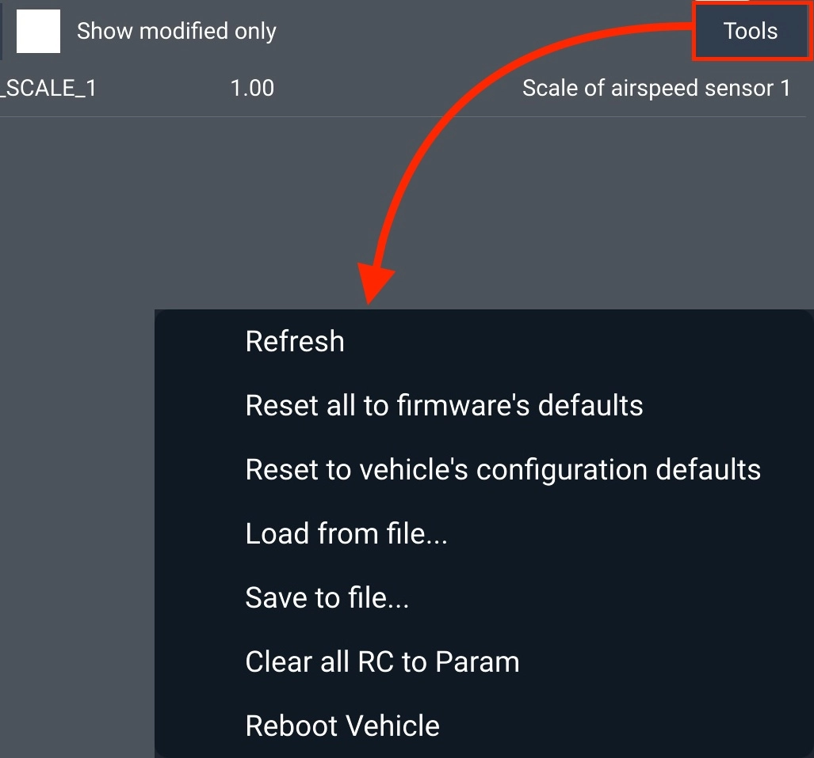

# Updating Firmware

## Updating Aurora Firmware

* Download the firmware file from the **Aurora Support page** or the [Suite](https://suite.auterion.com/).
* Connect Aurora to your computer with a USB cable.
* Power on the aircraft **with one battery** and wait about 15 seconds for the aircraft to boot fully.
* Using a browser such as Chrome or Safari, open the aircraft's info/update page at [http://10.41.1.1](http://10.41.1.1) (an internet connection is unnecessary).
* In the Update Auterion OS box, click Browse, and select the firmware file downloaded above.
* Click Update. (It should take about 10 minutes.)
* After the update completion message, verify that the webpage shows a "Release name" that matches the downloaded file and that all the motor LEDs are on.

## Updating Herelink Firmware


We kindly request that you refrain from resetting Herelink to its factory settings as this may result in the loss of Camflite's custom configurations. These configurations are essential for achieving optimal performance with Aurora straight out of the box. If you experience any difficulties while using Herelink, please do not hesitate to contact us at contact@camflite.com for assistance.


* Connect your Herelink to the internet through WiFi.
* Swipe down from the top of the screen to pull down the Android quick menu.
* If there are any updates available, you will see them here. Follow the instructions to get your software updated. Alternatively, go to Android Settings > About phone > System Updates.&#x20;

## Reset to Default Aurora Parameters

* Open AMC and activate Advanced mode
* Connect AMC to Aurora
* Select: Vehicle setup > Parameters > Tools > Reset to vehicle's configuration defaults.
* Reboot Vehicle
* Calibrate sensors as required

<figure><figcaption></figcaption></figure>
