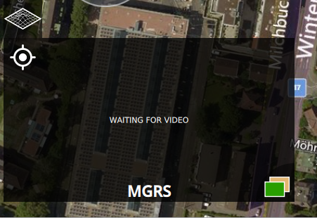
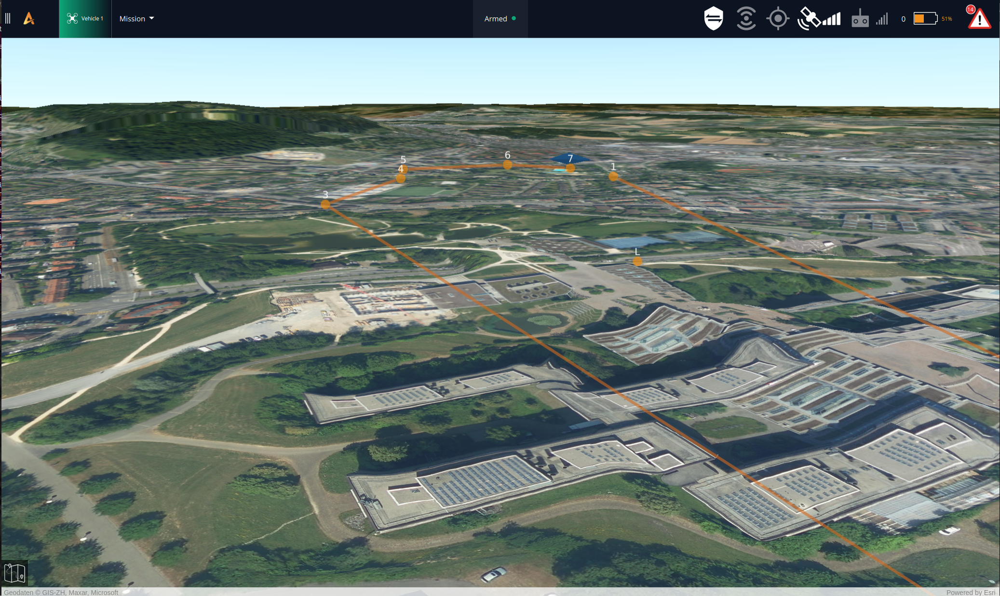

# 3D View


The 3D View is based on the [ArcGIS](https://www.esri.com/en-us/arcgis/products/arcgis-online/overview) from [ESRI ](https://www.esri.com/en-us/home)and provides a great tool for a 3D visualization of the planned mission during planning and flying.


The 3D view enhances the planning and execution of a mission by giving a sense of the elevation and the detailed form of the ground below the flying vehicle. It can provide valuable information to the user that can lead to more accurate altitude planning based on actual requirements.\
\
To Access the 3D view, a button on top of the small video screen should be used:

<figure><figcaption></figcaption></figure>

When the button is pressed the 3D view appears on the main view Window. To return to the former view the 2D view button on the bottom left corner should be pressed.

<figure><figcaption></figcaption></figure>


The 3D View will only be available if a valid ESRI license token has been provided under the General Settings -> Miscellaneous field.


<figure><figcaption></figcaption></figure>

