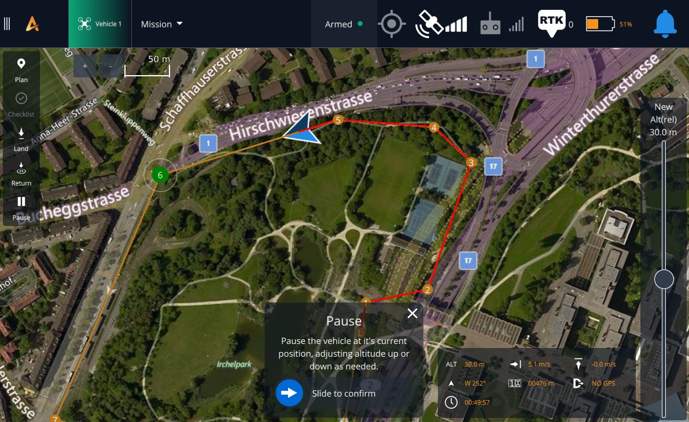

# Flying a Mission

_Auterion Mission Control_ will automatically prompt you to _start, continue or resume_ a loaded mission, and you can also use the **Action** button at the bottom of the toolbar to choose any actions that are appropriate for the vehicle state (e.g. to start, pause, or continue a mission). You can also set any waypoint as the current target by selecting it on the map and then using the confirmation slider.


If you have a mission loaded but you want to fly manually, you can cancel the prompts and get them back later using the **Action** button. To stop the prompts altogether you will need to clear the mission from the vehicle (use [Plan View > File/Sync](broken-reference) tools to clear the mission).&#x20;


## Start Mission

<figure><figcaption></figcaption></figure>

The drone will arm, take off and start the mission without you doing anything else. It is that easy! You can [monitor the progress](broken-reference) on the map and use the telemetry instrumentation provided.

<figure><figcaption></figcaption></figure>

## Pause and Continue Mission

Pause a mission by selecting the **Pause** button on the toolbar and then using the slider on the confirmation prompt. The altitude at which the vehicle should wait when paused may be set using the vertical slider on the right-hand side of the screen.

<figure><figcaption></figcaption></figure>

_Mission Control_ will prompt you to continue the mission after pausing (or if you take off with a mission loaded). If the dialog is closed, you can get it back and continue the mission using the **Action** button on the toolbar.&#x20;

<figure><figcaption></figcaption></figure>

For more details on flying missions, please [Click Here](https://docs.auterion.com/operators/flight-operations/fly/flying-a-mission)
