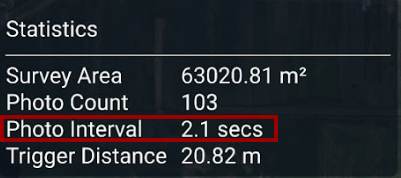

# Pre-flight Planning

## Weather

The quality of maps is significantly affected by the weather conditions during photography. The camera lens has certain limitations and requires high shutter speeds to avoid blurring, causing maps to be clearest when captured under bright sunlight. Pictures should be taken around noon for optimal results when the sun is directly overhead, resulting in fewer shadows. Nevertheless, a bright, overcast day is also suitable for capturing clear maps for similar reasons.

Capturing accurate maps necessitates proper illumination. An ideal scenario would be a bright, sunny day with minimal shadows. However, an overcast day can also be conducive as it offers similar lighting. In circumstances with low ambient light, such as in heavy clouds or evenings, the camera will expose the scene but may need to increase the ISO for a reasonably clear image.

Capturing precise maps can be effectively accomplished by utilizing overcast, which is highly suitable for this task for various reasons. When ambient light is too intense, the exposure can be easily adjusted to the desired level. Nonetheless, if the plate number exceeds ISO 1000, noise and blur caused by the denoising filter in the camera may start to affect the photo quality. In contrast, in low light conditions, the shutter speed can be decreased to obtain a clear image, which may result in the drone requiring more time to capture the picture.&#x20;

When developing a high-quality image, the shutter speed can be adjusted to obtain a clean image, but slower shutter speeds require more stability.

## Download Maps for Offline Use

AMC caches recent maps. To make sure that maps for a specific location are stored on your Herelink before you go to a site with no internet, download them while the Herelink is connected to wifi.&#x20;

Offline maps rely on satellite data acquired from a designated source, such as Bing Hybrid maps. The downloaded tiles are then utilized to generate a map for a maximum of two different zoom levels. It's worth noting that the image quality tends to enhance as you increase the zoom level. However, as you increase the zoom level, more tiles are required to cover the displayed area on your screen.

When focusing too closely on expansive regions, the map's file size can greatly increase. As such, it's advisable to employ lower zoom levels for expansive areas, but higher zoom levels for smaller ones if you intend to use the map offline. After having customized the map to your preferences, select the Download option.

Once the map download is complete, you can access it in the Offline Maps section. Even if you are offline, all missions in that vicinity will feature satellite images. Additionally, if you opted to "Fetch elevation data," you can also examine the terrain height while preparing for your mission.

## Plan a Mission

1\. Figure out the minimum safe flying altitude at your site (i.e. above obstacles and giving a good line of sight). Enter this value in AMC > Vehicle Setup > Safety > Return Altitude.

2\. Open the camera view for the payload, and select the settings icon. Select the lens that matches what you're using (default 24mm).

<figure><figcaption></figcaption></figure>

3\. To begin, access the AMC Plan view and locate the "Pattern" option on the left sidebar. Select it to generate a flight path that encompasses the designated area. This will prompt the camera to take pictures at set intervals. Decide on the preferred pattern type and shape, which will then be displayed on the map. For the time being, do not concern yourself with the specifics of the shape, as we will revisit it later.

4\. In the Pattern/Survey waypoint settings, open the Camera tab, and select Preset: Sony ɑ7R IV - 24 mm SIGMA.

<figure><figcaption></figcaption></figure>

5\. To properly set the altitude, first input the minimum safe value from step 1 into the Pattern Waypoint settings. Next, verify the Ground Sample Distance (GSD) located at the bottom of the Pattern Waypoint settings. If the GSD is below your requirements, then you must increase the altitude to achieve a larger GSD. Subsequently, navigate to the Mission Waypoint settings and input the same altitude there. This will guarantee that your altitude is accurately established for the mission.

6.To enable Terrain Display, select the T button in the bottom-left corner and check the heightmap to ensure a safe flight path.

<figure><figcaption></figcaption></figure>

<figure><figcaption></figcaption></figure>

7\. To ensure that your surveying is of high quality, it is essential that you correctly set the speed of your drone. Look at the Photo Interval value, which can be found at the bottom of the Survey settings on the right-hand side. For the best results, set the interval to 2 seconds or more.\
\
If you notice that the interval is less than 2 seconds, you can decrease the mission flight speed or increase the forward overlap. However, ensure the forward overlap is acceptable for your mission before increasing it.\
\
Conversely, if the photo interval exceeds 2 seconds, you can increase your flight speed to improve efficiency.

<figure><figcaption></figcaption></figure>

8.To ensure you get the map coverage, adjust the green area to be larger than the required area. Ensure you increase the green area on all sides by at least the width between flight passes. You can check the estimated flight duration on the top of the screen. If the estimated flight duration is more than 23 minutes, it may be necessary to take a second flight.

9\. It is recommended to add a "Return Waypoint" instruction to your mission plan if you want your aircraft to return to its home base and land after completing the assigned task. However, this is an optional command. If your mission ends with a Pattern or Waypoint, the AMC (Autonomous Mission Controller) will not indicate the completion of the mission. In this case, your aircraft will remain at the final waypoint until the battery failsafe is triggered. At that point, Aurora (the autopilot system) will automatically initiate the return home process.

If these instructions are unclear or if you have any additional questions, you can learn more about planning in the[ AMC docs](https://docs.auterion.com/auterion-mission-control/plan) or contact us at support@camflite.com.

### Coverage

In order to obtain accurate results, it is important to capture 5 or 6 overlapping images of each point of interest on the map. However, achieving this level of coverage at the edges or corners may require a larger flight area than what is mapped. Additionally, it is important to note that when the gimbal is not facing directly downwards (such as during crosshatch surveys), the drone must move beyond the required imaging locations since the image's focus is ahead of the drone.

## USB Setup

The included USB will work with Aurora, but if you have issues or prefer a different drive for Aurora, see the USB Formatting section. Ensure 16GB is available for a mission.

### Included USB Flash Drive

Aurora and the mapping payload come equipped with a Samsung 64GB flash drive. If you require extra flash drives or need to replace the current one, we recommend selecting the same model as it has undergone rigorous testing. Doing so will also facilitate our support team in efficiently resolving any glitches you may encounter.

