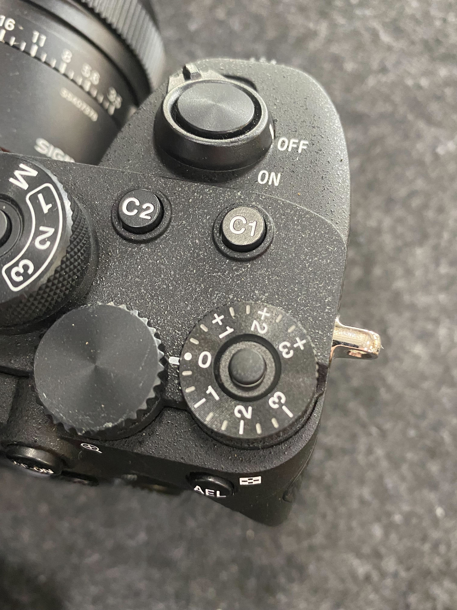

# Camera Setup

#### Camera body and 24 mm lens settings

Body Exposure Compensation Dial: 0, and the lock button engaged

<figure><figcaption></figcaption></figure>

#### AMC camera settings (tap slider icon below on-screen shutter button)

* Focus: Auto (infinity does work as well)
* Exposure Mode: Manual
* ISO: Auto
* Aperture: f/5 - f/11 depending on lighting conditions
* Shutter: 1/1000 or greater (can go as low as 1/500 but aircraft needs to slow down to prevent blur.
* Storage: USB Drive


In low light conditions, adjust the shutter speed and aperture to avoid high ISO. Open the aperture first, then decrease the shutter speed if needed, and reduce flight speed if motion blur persists.\
\
Wider apertures than f/5 can be used, but the photos will lose sharpness, so be sure to test if the resulting images' quality will satisfy your mission's needs.&#x20;

