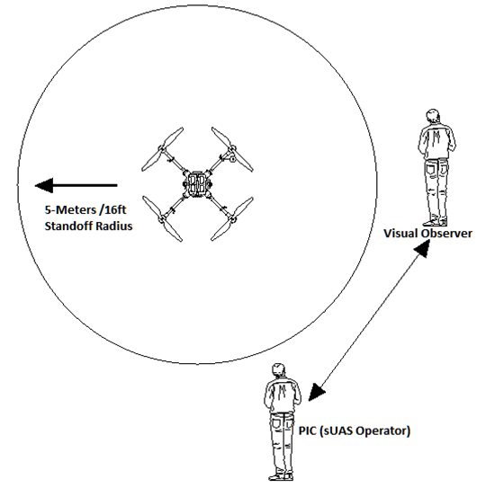

# Pre-Flight Procedures

Review the CamFlite GCS Safety settings, which include failsafe actions and key RTL parameters such as Altitude and activities that are appropriate for the flight planned.

Fundamental values include RTL altitude (obstacle clearance) and approach/descent parameters.

&#x20;Arming Aircraft and Take Off

The Aurora will be in a ready-to-arm state once the batteries are plugged in. Follow the steps below to arm Aurora:

* Select either Altitude Mode or Position Mode with the appropriate switches on the GCS system.
* &#x20;Complete the pre-flight checklist in the CamFlite GCS application to enable system arming.

### &#x20;Arming for Takeoff

* Activate the automatic takeoff or
*   &#x20;Move the left stick to the lower right corner until “armed is announced.”

    To disarm Aurora and return it to a ready state operator can do the following:
* Once landed, the throttle stick should be moved to the low throttle until “disarmed” is announced. The GCS confirms exercising caution until disarming.
* When using Autoland, the Aurora will automatically disarm, exercise caution, and remain ready at the controls until disarming is confirmed by the GCS

&#x20;


The PIC needs to be careful when working near people. If the PIC is within 30m (100 ft) of a person or a group of people, it is recommended to follow these guidelines:&#x20;


* It is advisable to avoid flying in Position mode if there are external factors that could potentially affect the performance of GPS.
* When operating near people, it is crucial to restrict the ground speed of sUAS to a maximum of 20 km/h (12.4 mph)..
*   To ensure safety, it's important not to position the sUAS directly upwind of individuals not involved in flight operations during windy conditions. This is because, in case of an emergency, they could be at risk of harm from the sUAS. Additionally, wind tends to have a more significant impact on flight at higher altitudes.

    &#x20;

&#x20;

<figure><figcaption></figcaption></figure>
