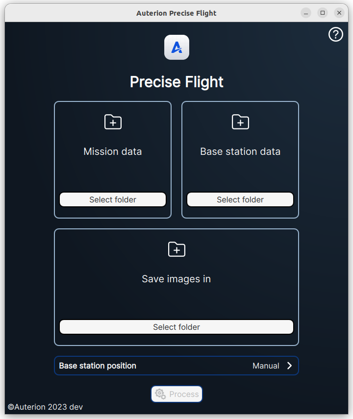
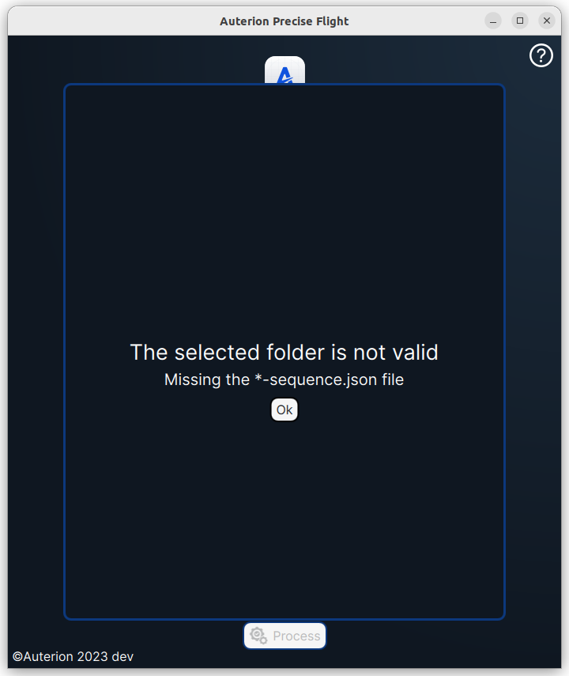
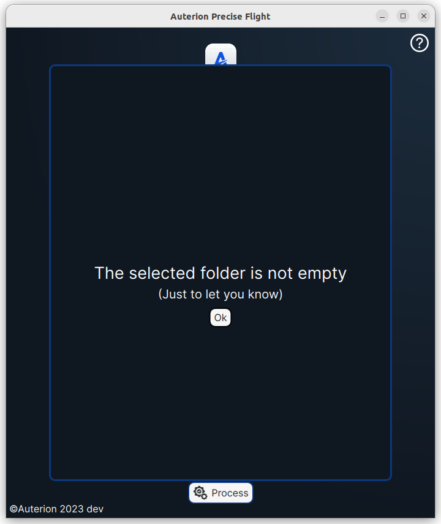

# Precise Flight

Preciseflight is a tool used for post-flight analysis that enables operators to run PPK on imagery collected with Powered-by-Auterion Vehicles. Users can select the required data folders from the main page.

<figure><figcaption></figcaption></figure>

### Mission Data

This folder has to contain the images taken during the survey. In particular, the folder has to contain the following description files:

* sequence.json file containing the sequence of the images.
* \*.obs file&#x20;
* imagelog.json file containing the log of the images.

When you select a folder that does not contain one of those files the software will show a popup with the error message like the following:

<figure><figcaption></figcaption></figure>

### Base Station Data

This folder has to contain the RINEX files matching the following file format name: .digit digit letter.

### Saves images in

<figure><figcaption></figcaption></figure>

### Select Base Station Position

Clicking on the ">" in the bottom right corner you'll gain access to the select base station position input window

From this section you can select one of the following methods to insert the base station position:

* **Manual**
* LLH
* Rinex

For best Accuracy results, inputting manually the base station position is recommended.

#### Manual

As the name stands, you can insert the latitude, longitude, and altitude of the base station position. Then just click on Set base position to accept the position.

<figure><figcaption></figcaption></figure>

LLH

In this mode, you can select a LLH file logged by the base station (E.g Emlid RS2) in order to set the base station position. Precise Flight will average the position and show the result on the map.

<figure><figcaption></figcaption></figure>

Selecting a valid.LLH file you'll get a confirmation popup like the following one:

<figure><figcaption></figcaption></figure>

By clicking on confirm the current base station position will be set to the imported one.

#### RINEX

Selecting RINEX the base station position will be read from the observation file header.

<figure><figcaption></figcaption></figure>

Based on our testing, this solution does not generate high-accuracy results.

### Process

Once you have selected all the required files, the button Process will be active and you can proceed with the PPK.

<figure><figcaption></figcaption></figure>

Then, the process is completed, a trajectory will be loaded on the map as follows:

<figure><figcaption></figcaption></figure>

Events that can't be geotagged will be flagged with a red dot.
