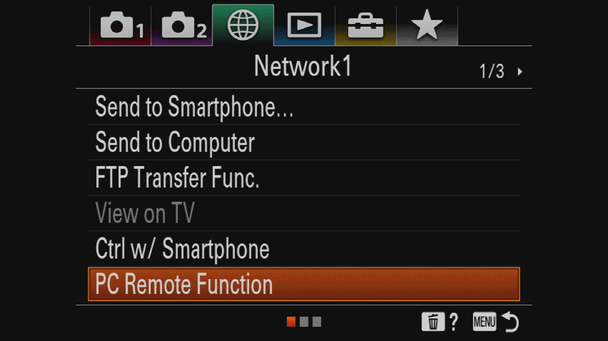
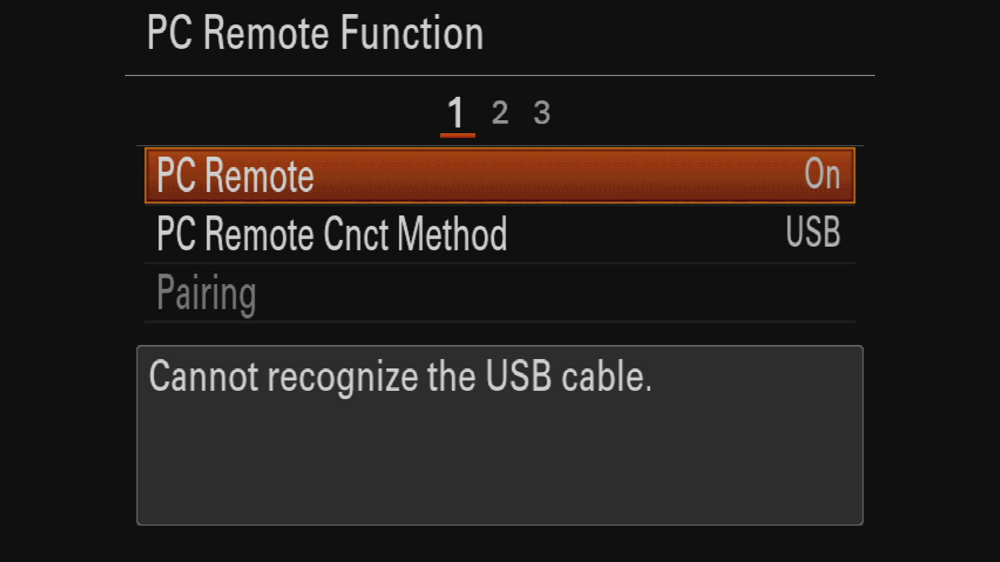

# Gremsy Gimbal w/Sony A7

## Supported Gimbals&#x20;

Currently, we support the following Gimbals from Gremsy&#x20;

* [Pixy U](https://gremsy.com/products/pixy-u)&#x20;
* [S1V3](https://gremsy.com/products/gremsy-s1v3)&#x20;
* [T3V3](https://gremsy.com/products/gremsy-t3v3)&#x20;
* [Pixy PE](https://gremsy.com/pixy-pe-spec)
* [T3 PE](https://gremsy.com/gremsy-t3-pe-spec)

## Sony Alpha a7R IV

<figure><figcaption></figcaption></figure>

## Preparation

To utilize the Sony a7R IV camera with Skynode, you must first enable the PC Remote Function feature on the camera.

1. Turn on the Sony a7R and open the Settings menu (Press **MENU** button):\
   &#x20;&#x20;
2. Navigate to the _Network1_ tab and open _PC Remote Function_.\
   &#x20;&#x20;
3. Set _PC Remote_ to **On** and make sure _PC Remote Cnct Method_ is set to **USB.** \
   &#x20;&#x20;
4. Exit the dialog by pressing the **MENU** button.&#x20;

Still under "Controls", select "Mavlink", this time select YES when prompted to enable MAVLink input

<figure><figcaption></figcaption></figure>

Power on Skynode, connect to it via USB-C and change the following parameters using [Auterion Mission Control's Advanced mode](broken-reference)

1. `MAV_2_CONFIG` = 401 (PPB)
2. `MAV_2_MODE` = 10 (Gimbal)&#x20;
3. `SER_PPB_BAUD` = 115200&#x20;
4. `MAV_2_FORWARD` = 1&#x20;
5. `MAV_S_FORWARD` = 1&#x20;
6. `MNT_MODE_IN` = 4 (MAVLink Gimbal v2)
7. reboot
8. refresh parameters or restart AMC
9. `MNT_MODE_OUT` = 2 (MAVLink Gimbal v2)
