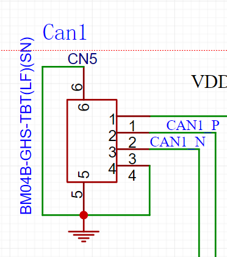
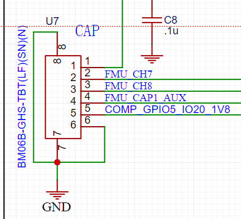
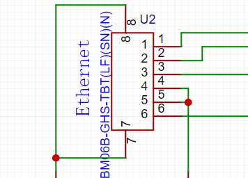
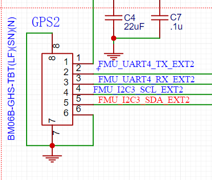

# I/O Board and Payload Power

The Input/Output (I/O) board, which is located at the bottom, acts as an interface between the Flight Management Unit (FMU) and various other components. It enables the FMU to access and control the rangefinder, nadir camera, and other similar devices, allowing for more efficient and accurate operation.

&#x20;

<figure><figcaption></figcaption></figure>

Onboard Power

Aurora has equipped the UAS with a 24v power source accessible through an XT30 connector at the bottom. The power supply is fed through a fused switching system and regulated by a linear regulator, ensuring clean and reliable power.

## I/O outputs

USB-C for webcam, flash storage, etc

**Telem1**- UART4 and I2C from FMU

**Ethernet**- for camera or other network-based payloads

**Cap**- FMU CH 7 and CH 8, FMU CAP, and one GPIO from MC

**Can1**- CAN from FMU

**PWM**- ch7-8

<figure><figcaption></figcaption></figure>

 

<figure><figcaption></figcaption></figure>

<figure><figcaption></figcaption></figure>

 

<figure><figcaption></figcaption></figure>

## Payload Connector

<figure><figcaption>
Payload Pinouts
</figcaption></figure>

## USB-C FMU Plug

The Aurora drone features an exclusive USB port that is situated at the bottom of the device. This USB port is dedicated to direct connection to the onboard mission computer, which manages and coordinates the drone's operation. With this USB port, you can comfortably perform essential tasks such as upgrading the drone's firmware and communicating with the Flight Management Unit (FMU).To establish a connection with the flight computer, it is essential to power up the Aurora device as the USB port alone does not provide any power. Thus, you will need to ensure that the Aurora device is powered on before attempting to communicate with the flight computer.
