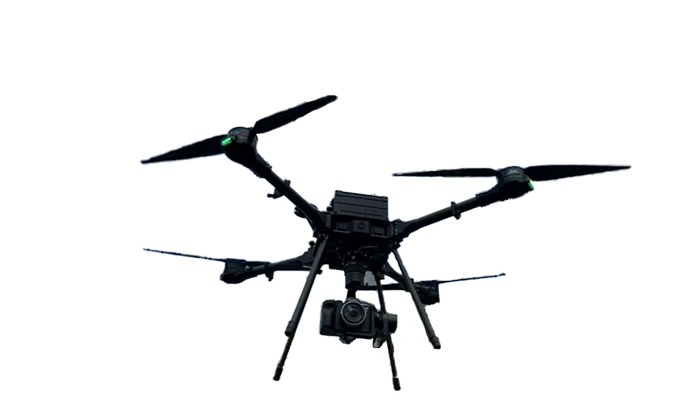

# Technical Specifications

<figure><figcaption></figcaption></figure>

* **Motors: (4)  170kv 44v**
* **Propeller size: 24”**
* **Weight: \~12 lbs. / \~5.5kg**
* **Max payload: \~15 lbs. / \~7 kg**
* **MTOW: 44 lbs. / 20kg**
* **Power: 10-30Ah 44v (2)6 cell Lipos**
* **Flight time: \~20– 45 minutes**
* **Control range: \~2 miles / \~3.2 km**
* **Max speed: 50 mph / 72 km/h**
* **Flight Control- Auterion Skynode**
* **Dust & water-resistant**
* **Operational Temp-10 to 50c**
* **Maximum thrust \~88 lbs. / \~40 kg**
* **FPV Camera**
* **Remote ID**&#x20;
* **LTE**&#x20;
* **Wifi 2.4 5.8ghz**

## Flight Controller

|                            |                                                                    |
| -------------------------- | ------------------------------------------------------------------ |
| Flight Controller Hardware |  Skynode                                                           |
| Flight Controller Software | Auterion Enterprise PX4                                            |
| Mission Control Software   | Auterion Mission Control                                           |
| Online Fleet Management    | Auterion Suite                                                     |
| Flight Modes               | Manual, Altitude Hold, Position Hold, Return, Autonomous Mission,  |
| Onboard Modules            | Cortex-A53 Computer, LTE                                           |
| Connectivity               | Wifi, USB C, LTE (North America)                                   |
| Supported Radios           | Herelink                                                           |
| Supported GNSS             | L1/L2 bands for GPS, GLONASS, Beidou and Galileo                   |
